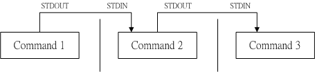

# 学习Swoole的必备知识

## PHP的四种运行方式

### cgi协议模式

​    cgi模式通用网关接口（Common Gateway Interface）,它允许web服务器通过特定的协议与应用程序通信,
调用原理大概为:用户请求->Web服务器接收请求->fork子进程 调用程序/执行程序->程序返回内容/程序调用结束->web服务器接收内容->返回给用户，由于每次用户请求,都得fork创建进程调用一次程序,然后销毁进程,所以性能较低

### fast-cgi协议模式

　　fast-cgi是cgi模式的升级版,它像是一个常驻型的cgi,只要开启后,就可一直处理请求,不再需要结束进程,
调用原理大概为:web服务器fast-cgi进程管理器初始化->预先fork n个进程用户请求->web服务器接收请求->交给fast-cgi进程管理器->fast-cgi进程管理区接收,给其中一个空闲fast-cgi进程处理->处理完成,fast-cgi进程变为空闲状态,等待下次请求->web服务器接收内容->返回给用户

### 模块模式

​    apache+php运行时,默认使用的是模块模式,它把php作为apache的模块随apache启动而启动,接收到用户请求时则直接通过调用mod_php模块进行处理。

​    模块模式是以mod_php5模块的形式集成，此时mod_php5模块的作用是接收Apache传递过来的PHP文件请求，并处理这些请求，然后将处理后的结果返回给Apache。如果我们在Apache启动前在其配置文件中配置好了PHP模块（mod_php5），PHP模块通过注册apache2的ap_hook_post_config挂钩，在Apache启动的时候启动此模块以接受PHP文件的请求

### php-cli模式

​    php-cli模式属于命令行模式,对于很多刚开始学php就开始wamp,wnmp的开发者来说是最陌生的一种运行模式。该模式不需要借助其他程序,直接输入php xx.php 就能执行php代码，命令行模式和常规web模式明显不一样的是:  

- 没有超时时间
- 默认关闭buffer缓冲
- STDIN和STDOUT标准输入/输出/错误 的使用
- echo var_dump,phpinfo等输出直接输出到控制台
- 可使用的类/函数 不同
- php.ini配置的不同

## 端口

### 物理端口

​    物理存在的端口，如ADSL Modem、集线器、交换机、路由器上用 于连接其他网络设备的接口，如RJ-45端口、SC端口等等。

### 逻辑端口

　　我们知道，一台拥有IP地址的主机可以提供许多服务，比如Web服务、FTP服务、SMTP服务等，这些服务完全可以通过1个IP地址来实现。那么，主机是怎样区分不同的网络服务呢？显然不能只靠IP地址，因为IP
地址与网络服务的关系是一对多的关系。实际上是通过“IP地址+端口号”来区 分不同的服务的。

​    服务器一般都是通过知名端口号来识别的。例如，对于每个TCP/IP实现来说，FTP服务器的TCP端口号都是21，每个Telnet服务器的TCP端口号都是23，每个TFTP(简单文件传送协议)服务器的UDP端口号都是69。任何TCP/IP实现所提供的服务都用知名的1～1023之间的端口号。这些知名端口号由Internet
号分配机构（InternetAssignedNumbersAuthority,IANA）来管理。
到1992年为止，知名端口号介于1～255之间。256～1023之间的端口号通常都是由Unix系统占用，以提供一些特定的Unix服务—也就是说，提供一些只有Unix系统才有的、而其他操作系统可能不提供的服务，IANA管理1～1023之间所有的端口号。

​    Internet扩展服务与Unix特定服务之间的一个差别就是Telnet和Rlogin。它们二者都允许通过计算机网络登录到其他主机上。Telnet是采用端口号为23的TCP/IP标准且几乎可以在所有操作系统上进行实现。Rlogin只是为Unix系统设计的（尽管许多非Unix系统也提供该服务），它的有名端口号为513。

​    客户端通常对它所使用的端口号并不关心，只需保证该端口号在本机上是唯一的就可以了。客户端口号又称作临时端口号（即存在时间很短暂）。这是因为它通常只是在用户运行该客户程序时才存在，而服务器则只要主机开着的，其服务就运行。

​    大多数TCP/IP实现给临时端口分配1024～5000之间的端口号。大于5000的端口号是为其他服务器预留的（Internet上并不常用的服务)。我们可以在后面看见许多这样的给临时端口分配端口号的例子。
Solaris2.2是一个很有名的例外。通常TCP和UDP的缺省临时端口号从32768开始。

### 端口监控

#### netstat命令

​    使用netstat命令可查看端口占用情况，netstat命令各个参数说明如下:

- -a : 显示所有连接和监听端口
- -t : 仅显示TCP端口
- -u : 仅显示UDP端口
- -l : 仅显示有在 Listen (监听) 的服务状态
- -p : 显示建立相关链接的程序名
- -n : 以数字形式显示地址和端口号

```shell
netstat -ntulp |grep 80
```

#### lsof命令

​     lsof 需要访问核心内存和各种文件，所以必须以 root 用户的身份运行它才能够充分地发挥其功能

- lsof -i tcp #列出所有tcp网络连接
- lsof -i udp #列出所有udp网络连接信息
- lsof -i :8080 #列出使用8080端口信息

## 防火墙说明

​    当你开启一个tcp服务，却发现访问不了，那么你得考虑下是否是防火墙拦截了，目前，最常见的拦截有以下几种情况：

- 服务器本机防火墙拦截
- 服务器供应商拦截(阿里云,腾讯云安全组)

服务器本机拦截,可通过防火墙管理软件,开端口,或者直接关闭防火墙进行解决(不建议):
例如centos 7下,防火墙管理软件为firewalld.
基础命令为:

```shell
systemctl start firewalld;#启动
systemctl stop firewalld;#停止
systemctl status firewalld;#查看状态
systemctl disable firewalld;#开机禁用
systemctl enable firewalld;#开启启动
firewall-cmd --zone=public --add-port=80/tcp --permanent #开放80/tcp端口  （--permanent永久生效，没有此参数重启后失效）;
firewall-cmd --reload;#
firewall-cmd --zone= public --query-port=80/tcp;#查看80/tcp端口
firewall-cmd --zone= public --remove-port=80/tcp --permanent;#删除该端口开放
```

## 进程和线程

### 进程

​    通俗来说，就是进行中的程序，运行中的程序。一个运行着的程序，可能有多个进程。操作系统中每一个执行的进程，都有它自己的地址空间，而同一进程中可以有多个线程，也就是多个执行流在同时执行。这里的同时，如果是单核处理器，则此时并不是真正意义上的同时，由于处理器运行速度很快，给每个执行流分配了时间片，在单核处理器中微观上还是顺序执行，而在多核处理器中，就是真正意义上的并行。

### 进程管理

​    我们可以使用ps 查看当前进程(相当于windows的任务管理器)，用于筛选出当前运行中,包含php关键字的进程信息

```shell
ps -ef |grep php
```

   通过kill -9 PID可杀死某一个进程:

```shell
kill -9 10618
```

   使用killall 可杀死指定名字的进程:

```shell
killall -9 php
```

### 线程

​    有时被称为轻量进程，是程序执行流的最小单元，线程是进程中的一个实体，是被系统独立调度和分派的基本单位。一切进程至少都有一个线程。Linux并不存在真正的线程，Linux的线程是使用进程模拟的

### 进程与线程区别

- 地址空间：进程间相互独立，每个进程都有自己独立的地址空间，同一进程的各线程间共享地址空间。某个进程内的线程在其他进程内不可见。
- 通信关系：进程间通信有管道，消息队列，共享内存，信号量。线程间通信可以直接读写全局变量来进行通信。不管是进程还是线程，通信时可能出现数据不一致的情况，需要用同步互斥机制来保证数据的一致性。
- 切换和调度：由于进程间独占数据段代码段等信息，所以切换进程的时候，需要把进程间独占的资源切换去，把要执行的进程资源换进来，而线程是进程的子集，共享大部分资源，切换时只需要保存上下文相关信息就好，所以线程切换的开销比进程切换的开销小。

## 管道

### 符号表示

`|` 和管道特别形象

``` shel
$ ls -al /etc | less
```

通过管道将`ls -al`的输出作为 下一个命令`less`的输入，方便浏览



### 作用

​    管道是Linux中很重要的一种通信方式,是把一个程序的输出直接连接到另一个程序的输入,常说的管道多是指无名管道,无名管道只能用于具有亲缘关系的进程之间，这是它与有名管道的最大区别。有名管道叫named pipe或者FIFO(先进先出)，可以用函数mkfifo()创建。

### 实现机制

​    在Linux中，管道是一种使用非常频繁的通信机制。从本质上说，管道也是一种文件，但它又和一般的文件有所不同，管道可以克服使用文件进行通信的两个问题，具体表现为：

+ 限制管道的大小。实际上，管道是一个固定大小的缓冲区。在Linux中，该缓冲区的大小为1页，即4K字节，使得它的大小不象文件那样不加检验地增长。使用单个固定缓冲区也会带来问题，比如在写管道时可能变满，当这种情况发生时，随后对管道的write()调用将默认地被阻塞，等待某些数据被读取，以便腾出足够的空间供write()调用写。

+ 读取进程也可能工作得比写进程快。当所有当前进程数据已被读取时，管道变空。当这种情况发生时，一个随后的read()调用将默认地被阻塞，等待某些数据被写入，这解决了read()调用返回文件结束的问题。

  注意：从管道读数据是一次性操作，数据一旦被读，它就从管道中被抛弃，释放空间以便写更多的数据。

## 什么是消息队列

### 概念

- 消息（Message）是指在应用之间传送的数据，消息可以非常简单，比如只包含文本字符串，也可以更复杂，可能包含嵌入对象
- 消息队列（英语：Message queue）是一种进程间通信或同一进程的不同线程间的通信方式，软件的贮列用来处理一系列的输入，通常是来自用户。消息队列提供了异步的通信协议，每一个贮列中的纪录包含详细说明的数据，包含发生的时间，输入设备的种类，以及特定的输入参数，也就是说：消息的发送者和接收者不需要同时与消息队列互交。消息会保存在队列中，直到接收者取回它

### 应用场景

- 异步处理

  场景说明：用户注册后，需要发注册邮件和注册短信。传统的做法有两种 1.串行的方式；2.并行方式

  - 串行方式：将注册信息写入数据库成功后，发送注册邮件，再发送注册短信。以上三个任务全部完成后，返回给客户端
  - 并行方式：将注册信息写入数据库成功后，发送注册邮件的同时，发送注册短信。以上三个任务完成后，返回给客户端。与串行的差别是，并行的方式可以提高处理的时间

- 应用解耦

  场景说明：用户下单后，订单系统需要通知库存系统。传统的做法是，订单系统调用库存系统的接口

  传统模式的缺点：假如库存系统无法访问，则订单减库存将失败，从而导致订单失败，订单系统与库存系统耦合

  订单系统：用户下单后，订单系统完成持久化处理，将消息写入消息队列，返回用户订单下单成功

  库存系统：订阅下单的消息，采用拉/推的方式，获取下单信息，库存系统根据下单信息，进行库存操作

  假如：在下单时库存系统不能正常使用。也不影响正常下单，因为下单后，订单系统写入消息队列就不再关心其他的后续操作了。实现订单系统与库存系统的应用解耦

- 流量削锋

  流量削锋也是消息队列中的常用场景，一般在秒杀或团抢活动中使用广泛

  应用场景：秒杀活动，一般会因为流量过大，导致流量暴增，应用挂掉。为解决这个问题，一般需要在应用前端加入消息队列

  - 可以控制活动的人数
  - 可以缓解短时间内高流量压垮应用

  用户的请求，服务器接收后，首先写入消息队列。假如消息队列长度超过最大数量，则直接抛弃用户请求或跳转到错误页面。秒杀业务根据消息队列中的请求信息，再做后续处理

## 网络协议

### 概念

​    网络协议为计算机网络中进行数据交换而建立的规则、标准或约定的集合。例如，网络中一个微机用户和一个大型的操作员进行通信，由于这两个数据终端所用不同，因此操作员所输入的命令彼此不认识。为了能进行通信，规定每个终端都要将各自字符集中的字符先变换为标准字符集的字符后，才进入网络传送，到达目的终端之后，再变换为该终端字符集的字符。当然，对于不相容终端，除了需变换字符集字符外还需转换其他特性，如显示格式、行长、行数、屏幕滚动方式等也需作相应的变换

### 层次

​    为了使不同计算机厂家生产的计算机能够相互通信，以便在更大的范围内建立计算机网络，国际标准化组织（ISO）在1978年提出了“开放系统互联参考模型”，即著名的OSI/RM模型（Open System Interconnection/Reference Model）。它将计算机网络体系结构的通信协议]划分为七层，自下而上依次为：物理层、数据链路层、网络层、传输层、会话层、表示层、应用层

|    名称    |               功能               |
| :--------: | :------------------------------: |
|   物理层   | 实现计算机系统与网络间的物理连接 |
| 数据链路层 |  进行数据打包与解包，形成信息帧  |
|   网络层   |        提供数据通过的路由        |
|   传输层   |      提供传输顺序信息与响应      |
|   会话层   |          建立和中止连接          |
|   表示层   |      数据转换、确认数据格式      |
|   应用层   |         提供用户程序接口         |

### TCP协议

​    TCP（Transmission Control Protocol）是一种面向连接的、可靠的、基于字节流的传输层通信协议。在简化的计算机网络OSI模型中，它完成第四层传输层所指定的功能

#### 三次握手

​    TCP是因特网中的传输层协议，使用三次握手协议建立连接。当主动方发出SYN连接请求后，等待对方回答SYN+ACK ，并最终对对方的 SYN 执行 ACK 确认。这种建立连接的方法可以防止产生错误的连接，TCP使用的流量控制协议是可变大小的滑动窗口协议。
TCP三次握手的过程如下：

- 客户端发送`SYN（SEQ=x）`报文给服务器端，进入`SYN_SEND`状态。
- 服务器端收到`SYN`报文，回应一个`SYN （SEQ=y）ACK(ACK=x+1）`报文，进入`SYN_RECV`状态。
- 客户端收到服务器端的SYN报文，回应一个`ACK(ACK=y+1）`报文，进入`Established`状态。

#### 连接成功

连接成功之后双方即可互相传输字节流,并随时可关闭连接,传输的数据有以下特性  

- 传输的数据被tcp分割成了最适合发送的数据块 传递给ip协议,这个发送数据称为 报文段 或 段 
- tcp作为可靠性连接,每次发送数据段,会启动一个定时器,每次接收数据段,会发送一次确认,如果定时器没有及时收到确认,则会重发数据
- TCP将保持它首部和数据的检验和。这是一个端到端的检验和，目的是检测数据在传输过程中的任何变化。如果收到段的检验和有差错，TCP将丢弃这个报文段和不确认收到此报文段（希望发端超时并重发）。
- 两个应用程序通过TCP连接交换8bit字节构成的字节流。TCP不在字节流中插入记录标识符。我们将这称为字节流服务（bytestreamservice）。如果一方的应用程序先传10字节，又传20字节，再传50字节，连接的另一方将无法了解发方每次发送了多少字节。只要自己的接收缓存没有塞满，TCP  接收方将有多少就收多少。一端将字节流放到TCP连接上，同样的字节流将出现在TCP连接的另一端。

#### 四次挥手

​    建立一个连接需要三次握手，而终止一个连接要经过四次挥手，这是由TCP的半关闭（half-close）造成的。具体过程如下所示。

- 某个应用进程首先调用close，称该端执行“主动关闭”（active close）。该端的TCP于是发送一个FIN分节，表示数据发送完毕。
- 接收到这个FIN的对端执行 “被动关闭”（passive close），这个FIN由TCP确认。
- 注意：FIN的接收也作为一个文件结束符（end-of-file）传递给接收端应用进程，放在已排队等候该应用进程接收的任何其他数据之后，因为，FIN的接收意味着接收端应用进程在相应连接上再无额外数据可接收。
- 一段时间后，接收到这个文件结束符的应用进程将调用close关闭它的套接字。这导致它的TCP也发送一个FIN。
- 接收这个最终FIN的原发送端TCP（即执行主动关闭的那一端）确认这个FIN。 既然每个方向都需要一个FIN和一个ACK，因此通常需要4个分节。

#### TCP连接的状态

- LISTEN:首先服务端需要打开一个socket进行监听，状态为LISTEN. /* The socket is listening for incoming connections. 侦听来自远方TCP端口的连接请求 */ 
- SYN_SENT:客户端通过应用程序调用connect进行active  open.于是客户端tcp发送一个SYN以请求建立一个连接.之后状态置为SYN_SENT. /*The socket is actively  attempting to establish a connection. 在发送连接请求后等待匹配的连接请求 */ 
- SYN_RECV:服务端应发出ACK确认客户端的SYN,同时自己向客户端发送一个SYN.之后状态置为SYN_RECV /* A  connection request has been received from the network.  在收到和发送一个连接请求后等待对连接请求的确认 */ 
- ESTABLISHED: 代表一个打开的连接，双方可以进行或已经在数据交互了。/* The socket has an established connection. 代表一个打开的连接，数据可以传送给用户 */ 
- FIN_WAIT1:主动关闭(active  close)端应用程序调用close，于是其TCP发出FIN请求主动关闭连接，之后进入FIN_WAIT1状态./* The socket is  closed, and the connection is shutting down.  等待远程TCP的连接中断请求，或先前的连接中断请求的确认 */ 
- CLOSE_WAIT:被动关闭(passive  close)端TCP接到FIN后，就发出ACK以回应FIN请求(它的接收也作为文件结束符传递给上层应用程序),并进入CLOSE_WAIT. /*  The remote end has shut down, waiting for the socket to close.  等待从本地用户发来的连接中断请求 */ 
- FIN_WAIT2:主动关闭端接到ACK后，就进入了FIN-WAIT-2 ./* Connection is closed, and  the socket is waiting for a shutdown from the remote end. 从远程TCP等待连接中断请求  */ 
- LAST_ACK:被动关闭端一段时间后，接收到文件结束符的应用程序将调用CLOSE关闭连接。这导致它的TCP也发送一个FIN,等待对方的ACK.就进入了LAST-ACK . /* The remote end has shut down, and the  socket is closed. Waiting for acknowledgement. 等待原来发向远程TCP的连接中断请求的确认 */ 
- TIME_WAIT:在主动关闭端接收到FIN后，TCP就发送ACK包，并进入TIME-WAIT状态。/* The socket is  waiting after close to handle packets still in the  network.等待足够的时间以确保远程TCP接收到连接中断请求的确认 */ 
- CLOSING: 比较少见./* Both sockets are shut down but we still don't have all our data sent. 等待远程TCP对连接中断的确认 */ 
- CLOSED: 被动关闭端在接受到ACK包后，就进入了closed的状态。连接结束./* The socket is not being used. 没有任何连接状态 */ 

### UDP协议

​    UDP协议全称是用户数据报协议，在网络中它与TCP协议一样用于处理数据包，是一种无连接的协议。在OSI模型中，在第四层——传输层，提供面向事务的简单不可靠信息传送服务。UDP报文没有可靠性保证、顺序保证和流量控制字段等，可靠性较差

### HTTP协议

​    HTTP是一个客户端和服务器端请求和应答的标准（TCP）。客户端是终端用户，服务器端是网站。通过使用Web浏览器、网络爬虫或者其它的工具，客户端发起一个到服务器上指定端口（默认端口为80）的HTTP请求。（我们称这个客户端）叫用户代理（user  agent）。应答的服务器上存储着（一些）资源，比如HTML文件和图像。（我们称）这个应答服务器为源服务器（origin  server）。在用户代理和源服务器中间可能存在。 

​    多个中间层，比如代理，网关，或者隧道（tunnels）。尽管TCP/IP协议是互联网上最流行的应用，HTTP协议并没有规定必须使用它和（基于）它支持的层。事实上，HTTP可以在任何其他互联网协议上，或者在其他网络上实现。HTTP只假定（其下层协议提供）可靠的传输，任何能够提供这种保证的协议都可以被其使用。   

​    通常，由HTTP客户端发起一个请求，建立一个到服务器指定端口（默认是80端口）的TCP连接。HTTP服务器则在那个端口监听客户端发送过来的请求。一旦收到请求，服务器（向客户端）发回一个状态行，比如"HTTP/1.1  200 OK"，和（响应的）消息，消息的消息体可能是请求的文件、错误消息、或者其它一些信息。  

​    HTTP使用TCP而不是UDP的原因在于（打开）一个网页必须传送很多数据，而TCP协议提供传输控制，按顺序组织数据，和错误纠正。  

​    通过HTTP或者HTTPS协议请求的资源由统一资源标示符（Uniform Resource Identifiers）（或者，更准确一些，URLs）来标识。

  

#### 执行过程

- 用户在浏览器输入www.baidu.com
- dns服务器解析/或者本机hosts，路由器hosts对比，获得ip
- 浏览器访问默认端口80，则访问的tcp地址为ip:80
- tcp协议3次握手，建立连接
- 发送一个http request请求头
- 服务器获得http request请求头，表明该次访问为http访问，解析http请求头，获得请求类型，请求格式，以及请求数据(cookie、get、post数据)
- 服务器发送response响应数据，主动断开
- 浏览器接收response响应数据，解析响应文本类型，解析数据，断开连接

#### 域名解析

​    域名解析是把域名指向网站空间IP，让人们通过注册的域名可以方便地访问到网站的一种服务。IP地址是网络上标识站点的数字地址，为了方便记忆，采用域名来代替IP地址标识站点地址。域名解析就是域名到IP地址的转换过程。域名的解析工作由DNS服务器完成。

​    域名解析也叫域名指向、服务器设置、域名配置以及反向IP登记等等。说得简单点就是将好记的域名解析成IP，服务由DNS服务器完成，是把域名解析到一个IP地址，然后在此IP地址的主机上将一个子目录与域名绑定。

​    互联网中的地址是数字的IP地址，域名解析的作用主要就是为了便于记忆。

#### 域名服务器

​    DNS（Domain Name Server，域名服务器）是进行域名(domain name)和与之相对应的IP地址 (IP 
address)转换的服务器。DNS中保存了一张域名(domain name)和与之相对应的IP地址 (IP 
address)的表，以解析消息的域名。 
​    域名是Internet上某一台计算机或计算机组的名称，用于在数据传输时标识计算机的电子方位（有时也指地理位置）。域名是由一串用点分隔的名字组成的，通常包含组织名，而且始终包括两到三个字母的后缀，以指明组织的类型或该域所在的国家或地区。

### WebSocket协议

​    WebSocket协议是基于TCP的一种新的网络协议。它实现了浏览器与服务器全双工(full-duplex)通信——允许服务器主动发送信息给客户端。

#### 产生背景

​    在没有WebSocket协议之前，在网页中，实现一个聊天室只能使用`ajax`不断轮询，请求服务器是否有数据产生，而这样的实现方法会出现一系列的问题:  

- 如果轮询时间间隔太短，会导致客户端和服务端在一个时间段内不断的进行http tcp的握手/挥手动作和http 请求头，响应头的传输，大量消耗服务器资源，如果用户量大的情况，会造成服务器的繁忙以至于宕机
- 客户端每次只能通过发送http请求获得服务器是否有数据返回，且数据的及时性无法保证

正因为在这种情况下，所以`WebSocket`出现了，它只需要一次http握手，就可以保持一个长连接，使得服务器可以主动发送消息给客户端，大大减少了轮询机制的消耗

#### 实现原理

​    在实现websocket连线过程中，需要通过浏览器发出websocket连线请求，然后服务器发出回应，这个过程通常称为“握手” 。在WebSocket API，浏览器和服务器只需要做一个握手的动作，然后，浏览器和服务器之间就形成了一条快速通道。两者之间就直接可以数据互相传送。在此WebSocket协议中，为我们实现即时服务带来了两大好处：

- Header: 互相沟通的Header是很小的
- Server Push: 服务器的推送，服务器不再被动的接收到浏览器的请求之后才返回数据，而是在有新数据时就主动推送给浏览器。

### TCP/IP协议

​    早在TCP/IP协议出现之前，国际标准化组织（ISO）就提出了开放系统互连（OSI）网络模型，为网络的设计、开发、编程、维护提供了便利的分而治之的思想，其先进性、科学性、实用性是不言而喻的。
TCP/IP协议不是单纯的两个协议，是一组不同层次上的多个协议的组合，常称为TCP/IP协议簇或者互联网协议簇。TCP/IP也是互联网的事实上的标准，为实现整个网络的互联提供指导。TCP/IP层次组合很难用OSI的七层模型来套用，它是OSI模型的浓缩，将原来的七层模型合并为四层协议的体系结构，自顶向下分别是应用层、传输层、网络层和网络接口层，没有OSI参考模型的会话层和表示层，一般认为TCP/IP的会话和表示功能是在传输层或应用层上完成的

## Socket

​    Socket是应用层与TCP/IP协议族通信的中间软件抽象层，它是一组接口。在设计模式中，Socket其实就是一个门面模式，它把复杂的TCP/IP协议族隐藏在Socket接口后面，对用户来说，一组简单的接口就是全部，让Socket去组织数据，以符合指定的协议。

​    前人已经给我们做了好多的事了，网络间的通信也就简单了许多，但毕竟还是有挺多工作要做的。以前听到Socket编程，觉得它是比较高深的编程知识，但是只要弄清Socket编程的工作原理，神秘的面纱也就揭开了。

​    一个生活中的场景。你要打电话给一个朋友，先拨号，朋友听到电话铃声后提起电话，这时你和你的朋友就建立起了连接，就可以讲话了。等交流结束，挂断电话结束此次交谈。生活中的场景就解释了这工作原理。


## IO

​    I/O输入/输出(Input/Output)，分为IO设备和IO接口两个部分。输入输出（IO）是指计算机同任何外部设备之间的数据传递。常见的输入输出设备有文件、键盘、打印机、屏幕等。数据可以按记录（或称数据块）的方式传递，也可以流的方式传递。

## 同步和异步

**同步**和**异步**通常用来形容一次方法调用，相对于操作结果来说，会不会等待结果返回。

- **同步方法**调用一旦开始，调用者必须等到方法调用返回后，才能继续后续的行为。
- **异步方法**调用更像一个消息传递，一旦开始，方法调用就会立即返回，调用者就可以继续后续的操作。而，异步方法通常会在另外一个线程中，“真实”地执行着。整个过程，不会阻碍调用者的工作。

## 同步、异步、阻塞、非阻塞实例

故事：老王烧开水。

出场人物：老张，水壶两把（普通水壶，简称水壶；会响的水壶，简称响水壶）。

老王想了想，有好几种等待方式

1.老王用水壶煮水，并且*站在那里*，*不管水开没开，每隔一定时间看看水开了没*。－**同步阻塞**

老王想了想，这种方法不够聪明。

2.老王还是用水壶煮水，不再傻傻的站在那里看水开，*跑去寝室上网*，*但是还是会每隔一段时间过来看看水开了没有，水没有开就走人*。－**同步非阻塞**

老王想了想，现在的方法聪明了些，但是还是不够好。

3.老王这次使用高大上的响水壶来煮水，*站在那里*，*但是不会再每隔一段时间去看水开，而是等水开了，水壶会自动的通知他*。－**异步阻塞**

老王想了想，不会呀，既然水壶可以通知我，那我为什么还要傻傻的站在那里等呢，嗯，得换个方法。

4.老王还是使用响水壶煮水，*跑到客厅上网去*，等着响水壶*自己把水煮熟了以后通知他*。－**异步非阻塞**


## ulimit命令

ulimit使用的基本格式为：

``` shell
ulimit [options] [limit]
```

具体的options参数含义如下表所示：

``` shell
-a 显示当前系统所有的limit资源信息。 
-H 设置硬资源限制，一旦设置不能增加。
-S 设置软资源限制，设置后可以增加，但是不能超过硬资源设置。
-c 最大的core文件的大小，以 blocks 为单位。
-f 进程可以创建文件的最大值，以blocks 为单位.
-d 进程最大的数据段的大小，以Kbytes 为单位。
-m 最大内存大小，以Kbytes为单位。
-n 查看进程可以打开的最大文件描述符的数量。
-s 线程栈大小，以Kbytes为单位。
-p 管道缓冲区的大小，以Kbytes 为单位。
-u 用户最大可用的进程数。
-v 进程最大可用的虚拟内存，以Kbytes 为单位。
-t 最大CPU占用时间，以秒为单位。
-l 最大可加锁内存大小，以Kbytes 为单位。
```

​    其中`ulimit -n`用于限制进程能够打开的文件描述符的最大数目。因为任何设备在linux下都是文件，通信的接口也有专门的接口文件负责，所以linux下进程tcp链接的最大并发量也受限于该值。

​    这个值可用ulimit 命令来修改,但ulimit命令修改的数值只对当前登录用户的目前使用环境有效,系统重启或者用户退出后就会失效。如果要永久修改ulimit，需要修改/etc/security/limits.conf