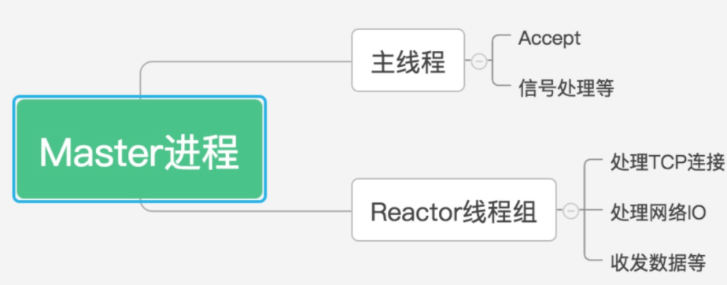
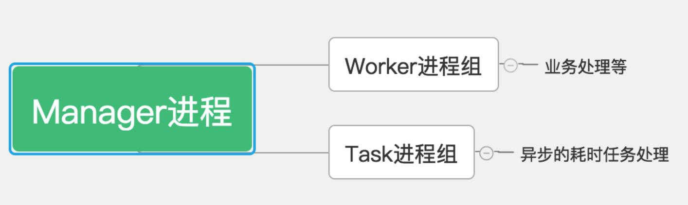
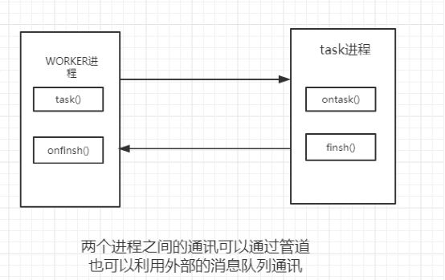
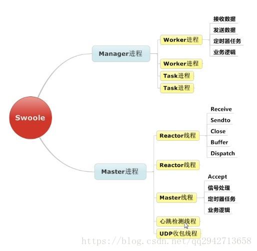
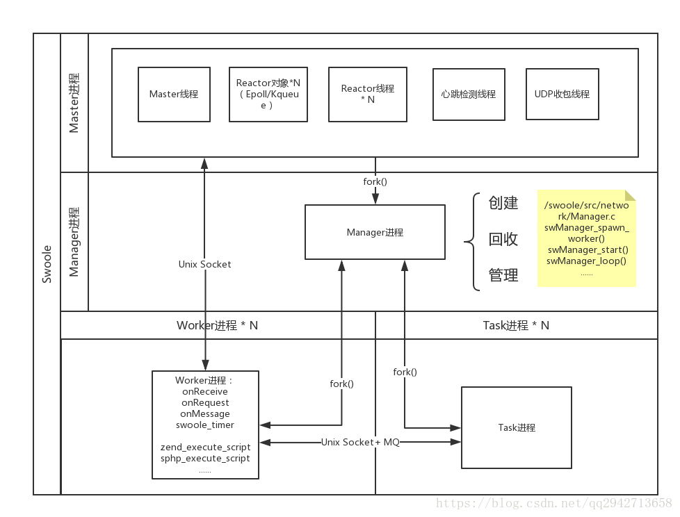
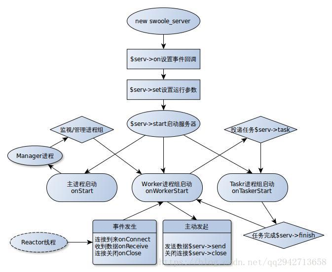

# 开始学习Swoole

## 什么是Swoole

### 概念

​    PHP的协程高性能网络通信引擎，使用C/C++语言编写，提供了PHP语言的异步多线程服务器，异步TCP/UDP网络客户端，异步MySQL，异步Redis，数据库连接池，AsyncTask，消息队列，毫秒定时器，异步文件读写，异步DNS查询。

​    Swoole内置了Http/WebSocket服务器端/客户端、Http2.0服务器端/客户端。
Swoole4支持完整的协程编程模式，可以使用完全同步的代码实现异步程序。PHP代码无需额外增加任何关键词，底层自动进行协程调度，实现异步IO。

​    除了异步IO的支持之外，Swoole为PHP多进程的模式设计了多个并发数据结构和IPC通信机制，可以大大简化多进程并发编程的工作。其中包括了并发原子计数器，并发HashTable，Channel，Lock，进程间通信IPC等丰富的功能特性。

### 应用领域

​    Swoole可以广泛应用于互联网、移动通信、企业软件、网络游戏、物联网、车联网、智能家庭等领域。 使用PHP + Swoole作为网络通信框架，可以使企业IT研发团队的效率大大提升，更加专注于开发创新产品。

### 协议

​    Swoole是开源免费的自由软件，授权协议是Apache2.0，企业和个人开发者均可免费使用，并且在Swoole之上所作的修改可用于商业产品，无需开源

## Swoole安装和更新

### 预装软件

- `Swoole-1.x`需要 `PHP-5.3.10` 或更高版本，`Swoole-4.x`需要 `PHP-7.0.0` 或更高版本
- `gcc-4.8` 或更高版本，编译失败请先尝试升级gcc
- `make`
- `autoconf`
- `pcre` (`CentOS`系统可以执行命令：`yum install pcre-devel`)

### 编译PHP扩展的相关工具

​    首先你需要下载一份扩展的源码，可以到github或者pecl.php.net上下载，解压后放到一个目录中，cd进入此目录。

#### autoconf

​    根据config.m4生成configure脚本，phpize是基于autoconf的封装

#### phpize

​    phpize这个工具是php官方提供的，用于将PHP扩展的config.m4解析生成./configure 脚本

#### configure

​    这个脚本是用来检测系统和环境状态，依赖库和头文件是否存在，编译配置等

#### php-config

​    这个工具执行后会打印当前PHP安装在哪里目录，API版本号是什么，扩展目录在哪里等信息。configure脚本需要依赖它找到PHP安装的目录

#### make

​    用来将.c源文件编译为目标文件。make install将编译好的扩展文件，如swoole.so安装到PHP的扩展目录下

#### gcc

​    编译器，将*.c源文件编译为目标文件。并连接所有目标文件生成swoole.so

### 手动编译安装

```shell
# 下载release版本的swoole
wget https://github.com/swoole/swoole-src/archive/master.tar.gz
# 解压
tar zxvf swoole.tar.gz
# 删除安装包
rm -rf swoole.tar.gz
# 切换目录
cd swoole
# 如果当前用户不是root，可能没有PHP安装目录的写权限，安装时需要sudo或者su
# 生成编译检测脚本
sudo phpize
# 编译配置检测
sudo ./configure
# 编译
sudo make
# 安装
sudo make install
```

### pecl一键安装

```shell
pecl install swoole
```

### 加载Swoole

编译安装成功后，修改`php.ini`加入

```ini
extension=swoole.so
```

或者通过`dl`函数动态载入

```php
dl('swoole.so')
```

通过`php -m`或`phpinfo()`、`php --ri swoole`来查看是否成功加载了`swoole.so`，如果没有可能是`php.ini`的路径不对，可以使用`php --ini`来定位到`php.ini`的绝对路径

### 升级版本

可以使用pecl进行安装和升级

```shell
pecl upgrade swoole
```
也可以直接从github/pecl下载一个新版本，重新安装编译

+ 更新swoole版本，不需要卸载或者删除旧版本swoole，安装过程会覆盖旧版本
+ swoole编译安装后没有额外的文件，仅有一个swoole.so，如果是在其他机器编译好的二进制版本。直接互相覆盖swoole.so，即可实现版本切换  
+ git clone拉取的代码，执行git pull更新代码后，务必要再次执行phpize、./configure、make clean、make install

## 创建服务器程序

​    使用者无需关注底层实现细节，仅需要设置网络事件的回调函数即可。`Server`只能用于`php-cli`环境，在其他环境下会抛出致命错误。

- `swoole_http_server`是`swoole_server`的子类，内置了`Http`的支持
- `swoole_websocket_server`是`swoole_http_server`的子类，内置了`WebSocket`的支持
- `swoole_redis_server`是`swoole_server`的子类，内置了`Redis`服务器端协议的支持

### 实例化Server对象

``` php
$serv = new Swoole\Server(string $host, int $port = 0, int $mode = SWOOLE_PROCESS,
    int $sock_type = SWOOLE_SOCK_TCP);
```

+ `$host`参数用来指定监听的ip地址，如`127.0.0.1`，或者外网地址，或者`0.0.0.0`监听全部地址
  + IPv4使用 `127.0.0.1`表示监听本机，`0.0.0.0`表示监听所有地址
  + IPv6使用`::1`表示监听本机，`::` (相当于`0:0:0:0:0:0:0:0`) 表示监听所有地址
+ `$port`监听的端口，如`9501`
  + 如果`$sock_type`为`UnixSocket Stream/Dgram`，此参数将被忽略
  + 监听小于`1024`端口需要`root`权限
  + 如果此端口被占用`server->start`时会失败
  + `Server`可以监听多个端口，每个端口都可以设置不同的协议处理方式(`set`)和回调函数(`on`)。`SSL/TLS`传输加密也可以只对特定的端口启用
+ `$mode`运行的模式
  + `SWOOLE_PROCESS`多进程模式（默认）
  + `SWOOLE_BASE`基本模式
+ `$sock_type`指定`Socket`的类型，支持`TCP`、`UDP`、`TCP6`、`UDP6`、`UnixSocket Stream/Dgram` 6种
+ 使用`$sock_type | SWOOLE_SSL`可以启用`SSL`隧道加密。启用`SSL`后必须配置ssl_key_file和ssl_cert_file

### 设置参数

​    `swoole_server::set`方法用于设置`swoole_server`运行时的各项参数

``` php
$serv->set(array(
    'worker_num' => 4,
    'daemonize' => true,
    'backlog' => 128,
));
```

### 注册事件回调函数

​    `Swoole\Server`是事件驱动模式，所有的业务逻辑代码必须写在事件回调函数中。当特定的网络事件发生后，底层会主动回调指定的`PHP`函数

###　启动服务

``` php
$serv->start();
```

### 捕获Server运行期致命错误

​    Server运行期一旦发生致命错误，那客户端连接将无法得到回应。如Web服务器，如果有致命错误应当向客户端发送Http 500 错误信息。

​    在PHP中可以通过`register_shutdown_function` + `error_get_last`2个函数来捕获致命错误，并将错误信息发送给客户端连接。具体代码示例如下：

``` php
register_shutdown_function('handleFatal');
function handleFatal()
{
    $error = error_get_last();
    if (isset($error['type']))
    {
        switch ($error['type'])
        {
        case E_ERROR :
        case E_PARSE :
        case E_CORE_ERROR :
        case E_COMPILE_ERROR :
            $message = $error['message'];
            $file = $error['file'];
            $line = $error['line'];
            $log = "$message ($file:$line)\nStack trace:\n";
            $trace = debug_backtrace();
            foreach ($trace as $i => $t)
            {
                if (!isset($t['file']))
                {
                    $t['file'] = 'unknown';
                }
                if (!isset($t['line']))
                {
                    $t['line'] = 0;
                }
                if (!isset($t['function']))
                {
                    $t['function'] = 'unknown';
                }
                $log .= "#$i {$t['file']}({$t['line']}): ";
                if (isset($t['object']) and is_object($t['object']))
                {
                    $log .= get_class($t['object']) . '->';
                }
                $log .= "{$t['function']}()\n";
            }
            if (isset($_SERVER['REQUEST_URI']))
            {
                $log .= '[QUERY] ' . $_SERVER['REQUEST_URI'];
            }
            error_log($log);
            $serv->send($this->currentFd, $log);
        default:
            break;
        }
    }
}
```

## Server多端口监听

​    `Server`可以监听多个端口，每个端口都可以设置不同的协议处理方式(`set`)和回调函数(`on`)。`SSL/TLS`传输加密也可以只对特定的端口启用。

+ **未调用set方法，设置协议处理选项的监听端口，默认继承主服务器的设置**
+ **未调用on方法，设置回调函数的监听端口，默认使用主服务器的回调函数**
+ 监听端口返回的对象类型为`swoole_server_port`
+ 监听端口的`swoole_server_port`对象，可以调用`set`和`on`方法，使用方法与`swoole_server`完全一致
+ 监听端口只能设置少量特定的选项，只能设置数据收发的相关事件回调函数
+ 不同监听端口的回调函数，仍然是相同的`Worker`进程空间内执行
+ 主服务器是WebSocket或Http协议，新监听的TCP端口默认会继承主Server的协议设置。必须单独调用`set`方法设置新的协议才会启用新协议

### 监听多端口

``` php
$port1 = $server->listen("127.0.0.1", 9501, SWOOLE_SOCK_TCP);
$port2 = $server->listen("127.0.0.1", 9502, SWOOLE_SOCK_UDP);
$port3 = $server->listen("127.0.0.1", 9503, SWOOLE_SOCK_TCP | SWOOLE_SSL);
```

### 设置网络协议

``` php
$port1->set([
    'open_length_check' => true,
    'package_length_type' => 'N',
    'package_length_offset' => 0,
    'package_max_length' => 800000
]);
```

### 设置回调函数

``` php
$port1->on('connect', function ($serv, $fd){
    echo "Client:Connect.\n";
});

$port1->on('receive', function ($serv, $fd, $from_id, $data) {
    $serv->send($fd, 'Swoole: '.$data);
    $serv->close($fd);
});

$port1->on('close', function ($serv, $fd) {
    echo "Client: Close.\n";
});

$port2->on('packet', function ($serv, $data, $addr) {
    var_dump($data, $addr);
});
```

### 多端口监听实例

​    Swoole提供了多端口监听的机制，这样可以同时监听UDP和TCP，同时监听内网地址和外网地址。内网地址和端口用于管理，外网地址用于对外服务

``` php
$serv = new swoole_server("0.0.0.0", 9501);
//这里监听了一个UDP端口用来做内网管理
$serv->addlistener('127.0.0.1', 9502, SWOOLE_SOCK_UDP);
$serv->on('connect', function ($serv, $fd) {
    echo "Client:Connect.\n";
});
$serv->on('receive', function ($serv, $fd, $from_id, $data) {
    $info = $serv->connection_info($fd, $from_id);
    //来自9502的内网管理端口
    if($info['server_port'] == 9502) {
        $serv->send($fd, "welcome admin\n");
    }
    //来自外网
    else {
        $serv->send($fd, 'Swoole: '.$data);
    }
});
$serv->on('close', function ($serv, $fd) {
    echo "Client: Close.\n";
});
$serv->start();
```

## Server属性列表

+ `Server::set()`函数所设置的参数会保存到`Server->$setting`属性上。在回调函数中可以访问运行参数的值。
+ `Server::$master_pid` 返回当前服务器主进程的PID。
+ `Server::$manager_pid` 返回当前服务器管理进程的PID。
+ `Server::$worker_id` 得到当前Worker进程的编号，包括Task进程。
+ `Server::$worker_pid` 得到当前Worker进程的操作系统进程ID。与posix_getpid()的返回值相同。
+ `Server::$taskworker` true表示当前的进程是Task工作进程，false表示当前的进程是Worker进程。
+ `Server::$connections` 可以使用foreach遍历服务器当前所有的连接，遍历的元素为单个连接的fd，连接迭代器依赖pcre库（不是PHP的pcre扩展），未安装pcre库无法使用此功能
+ `Server::$ports`  监听端口数组，如果服务器监听了多个端口可以遍历 `Server::$ports`得到所有的Swoole\Server\Port对象。其中swoole_server::$ports[0]为构造方法所设置的主服务器端口

## Server常用的配置选项

+ `reactor_num` `Reactor`线程数，通过此参数来调节主进程内事件处理线程的数量，以充分利用多核。默认会启用`CPU`核数相同的数量

  + `reactor_num`建议设置为`CPU`核数的`1-4`倍
  + `reactor_num`最大不得超过`SWOOLE_CPU_NUM * 4
  + `reactor_num`必须小于或等于`worker_num`，如果设置的`reactor_num`大于`worker_num`，会自动调整使`reactor_num`等于`worker_num`

+ `worker_num` 设置启动的Worker进程数。默认设置为SWOOLE_CPU_NUM，最大不得超过SWOOLE_CPU_NUM * 1000

+ `max_request` 设置worker进程的最大请求数，默认为0，一个worker进程在处理完超过此数值的请求后将自动退出，进程退出后会释放所有内存和资源。这个参数的主要作用是解决PHP进程内存溢出问题。PHP应用程序有缓慢的内存泄漏，但无法定位到具体原因、无法解决，可以通过设置`max_request`解决。`max_request`只能用于同步阻塞、无状态的请求响应式服务器程，在swoole中真正维持客户端TCP连接的是master进程，worker进程仅处理客户端发送来的请求，因为客户端是不需要感知Worker进程重启的，纯异步的Server不应当设置`max_request`，使用Base模式时`max_request`是无效的

+ `task_worker_num` 配置`Task`进程的数量，配置此参数后将会启用`task`功能。所以`Server`务必要注册`onTask`、`onFinish`2个事件回调函数。如果没有注册，服务器程序将无法启动。

+ `max_conn (max_connection)` 服务器程序，最大允许的连接数，如`max_connection => 10000`, 此参数用来设置`Server`最大允许维持多少个`TCP`连接。超过此数量后，新进入的连接将被拒绝。`max_connection`最大不得超过操作系统`ulimit -n`的值，否则会报一条警告信息，并重置为`ulimit -n`的值，`max_connection`参数不要调整的过大，根据机器内存的实际情况来设置。此选项设置过小底层会抛出错误，并设置为`ulimit -n`的值。最小值为`(worker_num + task_worker_num) * 2 + 32`

+ `dispatch_mode` 数据包分发策略。可以选择`7`种类型，默认为`2`

  + 1，轮循模式，收到会轮循分配给每一个`Worker`进程
  + 2，固定模式，根据连接的文件描述符分配`Worker`。这样可以保证同一个连接发来的数据只会被同一个`Worker`处理
  + 3，抢占模式，主进程会根据`Worker`的忙闲状态选择投递，只会投递给处于闲置状态的`Worker`
  + 4，IP分配，根据客户端`IP`进行取模`hash`，分配给一个固定的`Worker`进程。可以保证同一个来源IP的连接数据总会被分配到同一个`Worker`进程。算法为 `ip2long(ClientIP) % worker_num`
  + 5，`UID`分配，需要用户代码中调用 `Server->bind()`将一个连接绑定`1`个`uid`。然后底层根据`UID`的值分配到不同的`Worker`进程。算法为 `UID % worker_num`，如果需要使用字符串作为UID，可以使用`crc32(UID_STRING)`
  + 7，`stream`模式，空闲的`Worker`会`accept`连接，并接受`Reactor`的新请求

+ `daemonize` 守护进程化。设置`daemonize => true`时，程序将转入后台作为守护进程运行。长时间运行的服务器端程序必须启用此项。如果不启用守护进程，当ssh终端退出后，程序将被终止运行

  + 启用守护进程后，标准输入和输出会被重定向到 `log_file`
  + 如果未设置`log_file`，将重定向到 `/dev/null`，所有打印屏幕的信息都会被丢弃
  + 启用守护进程后，`CWD`（当前目录）环境变量的值会发生变更，相对路径的文件读写会出错。PHP程序中必须使用绝对路径

+ `log_file` log_file => '/data/log/swoole.log', 指定swoole错误日志文件。在swoole运行期发生的异常信息会记录到这个文件中。默认会打印到屏幕。注意log_file不会自动切分文件，所以需要定期清理此文件。观察log_file的输出，可以得到服务器的各类异常信息和警告。log_file中的日志仅仅是做运行时错误记录，没有长久存储的必要。在日志信息中，进程ID前会加一些标号，表示日志产生的线程/进程类型。`#` Master进程、`$` Manager进程、`*` Worker进程、`^` Task进程

+ `log_level` 设置`Server`错误日志打印的等级，范围是`0-5`。低于`log_level`设置的日志信息不会抛出

  ``` php
  $serv->set(array(
      'log_level' => 1,
  ));
  ```

  - 0 => SWOOLE_LOG_DEBUG
  - 1 => SWOOLE_LOG_TRACE
  - 2 => SWOOLE_LOG_INFO
  - 3 => SWOOLE_LOG_NOTICE
  - 4 => SWOOLE_LOG_WARNING
  - 5 => SWOOLE_LOG_ERROR

  `SWOOLE_LOG_DEBUG`和`SWOOLE_LOG_TRACE`仅在编译为`--enable-debug-log`和`--enable-trace-log`版本时可用
  默认为`SWOOLE_LOG_DEBUG`也就是所有级别都打印。在开启`daemonize`守护进程时，底层将把程序中的所有打印屏幕的输出内容写入到`log_file`，这部分内容不受`log_level`控制。

+ `pid_file` 在Server启动时自动将master进程的PID写入到文件，在Server关闭时自动删除PID文件。使用时需要注意如果Server非正常结束，PID文件不会删除，需要使用`swoole_process::kill($pid, 0)`来侦测进程是否真的存在

+ `heartbeat_check_interval` 启用心跳检测，此选项表示每隔多久轮循一次，单位为秒。如 `heartbeat_check_interval => 60`，表示每`60`秒，遍历所有连接，如果该连接在`60`秒内，没有向服务器发送任何数据，此连接将被强制关闭。`Server`并不会主动向客户端发送心跳包，而是被动等待客户端发送心跳。服务器端的`heartbeat_check`仅仅是检测连接上一次发送数据的时间，如果超过限制，将切断连接。被心跳检测切断的连接依然会触发`onClose`事件回调，`heartbeat_check`仅支持`TCP`连接

+ `heartbeat_idle_time` 与`heartbeat_check_interval`配合使用。表示连接最大允许空闲的时间。如:

  ``` php
  array(
      'heartbeat_idle_time' => 600,
      'heartbeat_check_interval' => 60,
  );
  ```

  + 表示每60秒遍历一次，一个连接如果600秒内未向服务器发送任何数据，此连接将被强制关闭
  + 启用`heartbeat_idle_time`后，服务器并不会主动向客户端发送数据包
  + 如果只设置了`heartbeat_idle_time`未设置`heartbeat_check_interval`底层将不会创建心跳检测线程，PHP代码中可以调用`heartbeat`方法手工处理超时的连接

+ `package_max_length` 设置最大数据包尺寸，单位为**字节**。开启open_length_check/open_eof_check/open_http_protocol等协议解析后。swoole底层会进行数据包拼接。这时在数据包未收取完整时，所有数据都是保存在内存中的。所以需要设定`package_max_length`，一个数据包最大允许占用的内存尺寸。如果同时有1万个TCP连接在发送数据，每个数据包2M，那么最极限的情况下，就会占用20G的内存空间。

  + `open_length_check`，当发现包长度超过`package_max_length`，将直接丢弃此数据，并关闭连接，不会占用任何内存。包括`websocket`、`mqtt`、`http2`协议。
  + `open_eof_check`，因为无法事先得知数据包长度，所以收到的数据还是会保存到内存中，持续增长。当发现内存占用已超过`package_max_length`时，将直接丢弃此数据，并关闭连接
  + `open_http_protocol`，GET请求最大允许8K，而且无法修改配置。POST请求会检测Content-Length，如果`Content-Length`超过`package_max_length`，将直接丢弃此数据，发送`http 400`错误，并关闭连接

+ `open_http_protocol` 启用Http协议处理，`Swoole\Http\Server`会自动启用此选项。设置为`false`表示关闭Http协议处理。

## 运行模式

### Base模式

​    这种模式就是传统的异步非阻塞Server了。在Reactor线程内直接回调PHP的函数。这个模式适合业务逻辑简单，并且onReceive中没有读文件、读取数据库、请求网络以及其他阻塞操作的场景。WebIM、Proxy、TimeServer、Memcached等就可以使用Base模式来运行，简单高效。在Swoole里还可以开多个线程，实现Multi Reactor，以充分利用多核。

### 线程模式

​    这个就是多线程Worker模式，Reactor线程来处理网络事件轮询，读取数据。得到的请求交给Worker线程去处理。Swoole提供了可配置的参数，以实现m/n的参数调整。在这种模式下onReceive可以有适度的阻塞操作。多线程模式比进程模式轻量一些，而且线程之间可以共享堆栈和资源。访问共享内存时会有同步问题，需要使用Swoole提供的锁机制来保护数据。目前已经提供了Mutex、读写锁、文件锁、信号量、自旋锁一共5种锁的实现。

### 进程模式

​    多进程模式是最复杂的方式，用了大量的进程间通信、进程管理机制。适合业务逻辑非常复杂的场景。Swoole提供了完善的进程管理、内存保护机制。在业务逻辑非常复杂的情况下，也可以长期稳定运行。Swoole在Reactor线程中提供了Buffer的功能，可以应对大量慢速连接和逐字节的恶意客户端。另外也提供了CPU亲和设置选项，使程序运行的效率更好。

## 自定义工作进程

​    添加一个用户自定义的工作进程。此函数通常用于创建一个特殊的工作进程，用于监控、上报或者其他特殊的任务。此函数在`1.7.9`以上版本可用，添加成功返回`true`，失败返回`false`

``` php
bool Server->addProcess(Process $process);
```

- `$process` 为`Process`对象，注意不需要执行`start`。在`Server`启动时会自动创建进程，并执行指定的子进程函数
- 创建的子进程可以调用`$server`对象提供的各个方法，如`getClientList`/`getClientInfo`/`stats`
- 在`Worker/Task`进程中可以调用`$process`提供的方法与子进程进行通信
- 在用户自定义进程中可以调用`$server->sendMessage`与`Worker/Task`进程通信

### 注意事项

- 用户进程内不能使用`Server->task/taskwait`接口
- 用户进程内可以使用`Server->send/close`等接口
- 用户进程内应当进行`while(true)`或`EventLoop`循环，否则用户进程会不停地退出重启

### 生命周期

用户进程的生存周期与`Master`和`Manager`是相同的，不会受到`reload`影响

- 用户进程不受`reload`指令控制，`reload`时不会向用户进程发送任何信息
- 在`shutdown`关闭服务器时，会向用户进程发送`SIGTERM`信号，关闭用户进程
- 自定义进程会托管到`Manager`进程，如果发生致命错误，`Manager`进程会重新创建一个

### 示例程序

``` php
$server = new Swoole\Server('127.0.0.1', 9501);

/**
 * 用户进程实现了广播功能，循环接收管道消息，并发给服务器的所有连接
 */
$process = new Swoole\Process(function($process) use ($server) {
    while (true) {
        $msg = $process->read();
        foreach($server->connections as $conn) {
            $server->send($conn, $msg);
        }
    }
});

$server->addProcess($process);

$server->on('receive', function ($serv, $fd, $reactor_id, $data) use ($process) {
    //群发收到的消息
    $process->write($data);
});

$server->start();
```

## reactor_id 和 fd

服务器的`onConnect`、`onReceive`、`onClose`回调函数中会携带`reactor_id`和`fd`两个参数

+ `$reactor_id`是来自于哪个reactor线程
  
+ `$fd`是`TCP`客户端连接的标识符，在`Server`实例中是唯一的，在多个进程内不会重复

+ `fd` 是一个自增数字，范围是`1 ～ 1600万`，fd超过`1600万`后会自动从`1`开始进行复用

+ `$fd`是复用的，当连接关闭后`fd`会被新进入的连接复用

+ 正在维持的TCP连接`fd`不会被复用

调用`swoole_server->send`/`swoole_server->close`函数需要传入`$fd`参数才能被正确的处理。如果业务中需要发送广播，需要用`apc`、`redis`、`MySQL`、`memcache`、`swoole_table`等方式将`fd`的值保存起来

```php
function my_onReceive($serv, $fd, $reactor_id, $data)  {
    //向Connection发送数据
    $serv->send($fd, 'Swoole: '.$data);
    //关闭Connection
    $serv->close($fd);
}
```

## swoole_table

​    `swoole_table`一个基于共享内存和锁实现的超高性能，并发数据结构。用于解决多进程/多线程数据共享和同步加锁问题。在`swoole_server->start()`之前创建`swoole_table`对象。并存入全局变量或者类静态变量/对象属性中。在worker/task进程中获取`swoole_table`对象，并使用

### swoole_table的优势

+ 性能强悍，单线程每秒可读写`200万`次
+ 应用代码无需加锁，`swoole_table`内置行锁自旋锁，所有操作均是多线程/多进程安全。用户层完全不需要考虑数据同步问题。
+ 支持多进程，`swoole_table`可以用于多进程之间共享数据
+ 使用行锁，而不是全局锁，仅当`2`个进程在同一`CPU`时间，并发读取同一条数据才会进行发生抢锁

+ `swoole_table`不受`PHP`的`memory_limit`控制
+ `swoole_table`在`1.7.5`以上版本可用

### swoole_table常用方法

+ `swoole_table->__construct` 创建内存表

  ```php
  swoole_table->__construct(int $size, float $conflict_proportion = 0.2)
  ```

  + `$size`参数指定表格的最大行数，如果`$size`不是为`2`的N次方，如`1024`、`8192`,`65536`等，底层会自动调整为接近的一个数字，如果小于1024则默认成1024，即1024是最小值
  + `table`占用的内存总数为 (结构体长度 + KEY长度64字节 + 行尺寸`$size`) * (1.2预留20%作为hash冲突) * (列尺寸)，如果机器内存不足table会创建失败
  + `set`操作能存储的最大行数与`$size`正相关，但不完全一致，如`$size`为1024实际可存储的行数小于`1024`

+ `swoole_table->column` 内存表增加一列

    ``` php
    bool swoole_table->column(string $name, int $type, int $size = 0);
    ```

    + `$name` 指定字段的名称
    + `$type` 指定字段类型，支持3种类型
      + swoole_table::TYPE_INT默认为4个字节，可以设置1，2，4，8一共4种长度
      + swoole_table::TYPE_STRING设置后，设置的字符串不能超过此长度
      + swoole_table::TYPE_FLOAT会占用8个字节的内存
    + `$size` 指定字符串字段的最大长度，单位为字节。字符串类型的字段必须指定

+ `swoole_table->create` 创建内存表

    ``` php
    function swoole_table->create() : bool;
    ```

    + 定义好表的结构后，执行`create`向操作系统申请内存，创建表
    + 调用`create`之前不能使用`set`、`get`等数据读写操作方法
    + 调用`create`之后不能使用`column`方法添加新字段
    + 系统内存不足，申请失败，`create`返回`false`
    + 申请内存成功，`create`返回`true`
    + `swoole_server`中使用`swoole_table`，`swoole_table->create()` 必须在`swoole_server->start()`前执行

+ `swoole_table->set` 设置行的数据，swoole_table使用key-value的方式来访问数据

    ``` php
    swoole_table->set(string $key, array $value)
    ```

    + `$key`，数据的`key`，相同的`$key`对应同一行数据，如果`set`同一个`key`，会覆盖上一次的数据
    + `$value`，必须是一个数组，必须与字段定义的`$name`完全相同
    + `swoole_table->set()` 可以设置全部字段的值，也可以只修改部分字段
    + `swoole_table->set()` 未设置前，该行数据的所有字段均为空
    + 如果传入字符串长度超过了列定义时设定的最大尺寸，底层会自动截断

+ `swoole_table->get` 获取一行数据

    ```php
    array swoole_table->get(string $key, string $field = null);
    ```

    + 如果$key不存在，将返回false
    + 成功返回结果数组
    + 当指定了`$field`时仅返回该字段的值，而不是整个记录

+ `swoole_table->exist` 检查table中是否存在某一个key

    ``` php
    bool swoole_table->exist(string $key)
    ```

+ `swoole_table->del` 删除数据

  ``` php
  bool swoole_table->del(string $key)
  ```

  + `$key`对应的数据不存在，将返回`false`
  + 成功删除返回`true`
  + `$key`必须为字符串类型

+ `swoole_table->count` 返回table中存在的条目数

  ``` php
  int function swoole_table->count();
  ```

## swoole_atomic

   `swoole_atomic`是swoole扩展提供的原子计数操作类，可以方便整数的无锁原子增减。

+ `swoole_atomic`使用共享内存，可以在不同的进程之间操作计数
+ `swoole_atomic`基于gcc提供的CPU原子指令，无需加锁
+ `swoole_atomic`在服务器程序中必须在`swoole_server->start`前创建才能在Worker进程中使用
+ `swoole_atomic`默认使用`32`位无符号类型，如需要`64`有符号整型，可使用`Swoole\Atomic\Long`

### swoole_atomic常用方法

+ `swoole_atomic->__construct` 创建一个原子计数对象。

  ``` php
  function swoole_atomic->__construct(int $init_value = 0)
  ```

  + `swoole_atomic`只能操作`32`位无符号整数，最大支持`42`亿，不支持负数
  + `$init_value`可以指定初始化的数值，默认为`0`

+ `swoole_atomic->add` 增加计数

  ``` php
  function swoole_atomic->add(int $add_value = 1)
  ```

  - $add_value要增加的数值，默认为1
  - $add_value必须为正整数
  - $add_value与原值相加如果超过42亿，将会溢出，高位数值会被丢弃
  - add方法操作成功后返回结果数值

+ `swoole_atomic->sub` 减少计数

  ``` php
  function swoole_atomic->sub(int $sub_value = 1)
  ```

  + $sub_value要减少的数值，默认为1
  + $sub_value必须为正整数
  + $sub_value与原值相减如果低于0将会溢出，高位数值会被丢弃
  + sub方法操作成功后返回结果数值

+ `swoole_atomic->get` 获取当前计数的值

  ``` php
  function swoole_atomic->get()
  ```

+ `swoole_atomic->set` 将当前值设置为指定的数字

  ``` php
  function swoole_atomic->set(int $value);
  ```

  + $value，指定要设置的目标数值
  + set方法没有任何返回值

## 事件回调

​    `Swoole\Server`是事件驱动模式，所有的业务逻辑代码必须写在事件回调函数中。当特定的网络事件发生后，底层会主动回调指定的`PHP`函数

### 事件回调函数

​    所谓的`回调函数(CallBack)`就好比是张开了夹子的捕鼠器，我们设定当有老鼠踩到捕鼠器的时候，他会关闭夹子然后捉住老鼠，我们放置捕鼠器的时候，捕鼠器并没有真的抓老鼠。这个设定就是回调，他不立刻执行，会在遇到触发条件(事件)时执行，在上面的示例当中我们放置了3个捕鼠器(回调函数)，我们只需要知道他会在特定老鼠(事件)踩到的时候(发生的时候)去执行我们期望的功能就好。

+ `onStart` 

  启动后在**主进程（master）**的主线程回调此函数，函数原型

  ``` php
  function onStart(Server $server);
  ```

  在此事件之前`Server`已进行了如下操作

  + 已创建了`manager`进程
  + 已创建了`worker`子进程
  + 已监听所有`TCP/UDP/UnixSocket`端口，但未开始`Accept`连接和请求
  + 已监听了定时器

+ `onWorkerStart`

  此事件在`Worker`进程/`Task`进程启动时发生。这里创建的对象可以在进程生命周期内使用，函数原型：

  ```php
  function onWorkerStart(swoole_server $server, int $worker_id);
  ```

  + `onWorkerStart`/`onStart`是并发执行的，没有先后顺序
  + 可以通过`$server->taskworker`属性来判断当前是`Worker`进程还是`Task`进程
  + 设置了`worker_num`和`task_worker_num`超过`1`时，每个进程都会触发一次`onWorkerStart`事件，可通过判断`$worker_id`区分不同的工作进程
  + 由 worker 进程向 task 进程发送任务，task 进程处理完全部任务之后通过onFinish回调函数通知 worker  进程。例如，我们在后台操作向十万个用户群发通知邮件，操作完成后操作的状态显示为发送中，这时我们可以继续其他操作。等邮件群发完毕后，操作的状态自动改为已发送

+ `onConnect`

  有新的连接进入时，在worker进程中回调。函数原型：

  ```php
  function onConnect(swoole_server $server, int $fd, int $reactorId);
  ```

  + `$server`是`Swoole\Server`对象
  + `$fd`是连接的文件描述符，发送数据/关闭连接时需要此参数
  + `$reactorId`来自哪个`Reactor`线程

+ `onReceive`

  接收到数据时回调此函数，发生在worker进程中。函数原型：

  ``` php
  function onReceive(swoole_server $server, int $fd, int $reactor_id, string $data);
  ```

  + `$server`，`Server`对象
  + `$fd`，`TCP`客户端连接的唯一标识符
  + `$reactor_id`，`TCP`连接所在的`Reactor`线程`ID`
  + `$data`，收到的数据内容，可能是文本或者二进制内容

+ `onClose`

  客户端连接关闭后，在worker进程中回调此函数。函数原型：

  ``` php
  function onClose(swoole_server $server, int $fd, int $reactorId);
  ```

  + `$server` 是swoole_server对象
  + `$fd` 是连接的文件描述符
  + `$reactorId` 来自那个reactor线程
  + 无论由客户端发起close还是服务器端主动调用`$serv->close()`关闭连接，都会触发此事件。因此只要连接关闭，就一定会回调此函数
  + `onClose`时表示客户端连接已经关闭，所以无需执行`$server->close($fd)`

+ `onTask`

  在task_worker进程内被调用。worker进程可以使用swoole_server_task函数向task_worker进程投递新的任务。当前的Task进程在调用`onTask`回调函数时会将进程状态切换为**忙碌**，这时将不再接收新的Task，当`onTask`函数返回时会将进程状态切换为**空闲**然后继续接收新的Task

  ``` php
  function onTask(swoole_server $serv, int $task_id, int $src_worker_id, mixed $data);
  ```

  + `$task_id` 是任务ID，由swoole扩展内自动生成，用于区分不同的任务。 
  + `$task_id` 和 `$src_worker_id`组合起来才是全局唯一的，不同的worker进程投递的任务ID可能会有相同
  + `$src_worker_id`来自于哪个worker进程
  + `$data` 是任务的内容

+ `onFinish`

  当worker进程投递的任务在task_worker中完成时，task进程会通过`swoole_server->finish()`方法将任务处理的结果发送给worker进程。

  ``` php
  onFinish(swoole_server $serv, int $task_id, string $data)
  ```

  + $task_id是任务的ID
  + $data是任务处理的结果内容
  + task进程的onTask事件中没有调用finish方法或者return结果，worker进程不会触发onFinish
  + 执行onFinish逻辑的worker进程与下发task任务的worker进程是同一个进程

## WEB服务器

### Http\Server

#### 原型

​    `Http\Server`继承自`Server`，是一个完整的`http`服务器实现。在`Server`的基础上默认开启了Http协议解析，并新增了一个回调函数`onRequest`，该回调函数原型如下：

``` php
function(swoole_http_request $request, swoole_http_response $response)；
```

​    当Swoole收到来自客户端的Http请求后，就会执行这个函数。该函数接收两个参数`swoole_http_request`和`swoole_http_response`

​    并且`Http\Server`屏蔽了`onConnect`和`onReceive`回调函数，`Http\Server`支持同步和异步2种模式，无论是同步模式还是异步模式，`Http\Server`都可以维持大量`TCP`客户端连接。同步/异步仅仅体现在对请求的处理方式上

#### 额外配置选项

+ `upload_tmp_dir` 设置上传文件的临时目录，目录最大长度不得超过220字节

  ``` php
  $serv->set(array(
      'upload_tmp_dir' => '/data/uploadfiles/',
  ));
  ```

+ `http_parse_post` 设置POST消息解析开关，选项为`true`时自动将`Content-Type`为`x-www-form-urlencoded`的请求包体解析到POST数组。设置为`false`时将关闭POST解析

  ``` php
  $serv->set(array(
      'http_parse_post' => false,
  ));
  ```

+ `document_root` 配置静态文件根目录，与`enable_static_handler`配合使用，设置`document_root`并设置`enable_static_handler`为`true`后，底层收到`Http`请求会先判断`document_root`路径下是否存在此文件，如果存在会直接发送文件内容给客户端，不再触发`onRequest`回调。使用静态文件处理特性时，应当将动态`PHP`代码和静态文件进行隔离，静态文件存放到特定的目录

+ `http_compression` 启用压缩。默认为开启。http-chunk不支持分段单独压缩，已强制关闭压缩。目前支持`gzip`、`br`、`deflate` 三种压缩格式，底层会根据浏览器客户端传入的`Accept-Encoding`头自动选择压缩方式。

  ``` php
  $sever->set([
      'http_compression' => true,
  ]);
  ```

### 创建

``` php
$http = new swoole_http_server("0.0.0.0", 9501);

$http->on('request', function ($request, $response) {
    var_dump($request->get, $request->post);
    $response->header("Content-Type", "text/html; charset=utf-8");
    $response->end("<h1>Hello Swoole. #".rand(1000, 9999)."</h1>");
});

$http->start();
```

​    Http服务器只需要关注请求响应即可，所以只需要监听一个`onRequest`事件。当有新的Http请求进入就会触发此事件。事件回调函数有2个参数，一个是$request对象，包含了请求的相关信息，包含了`header/get/post/cookie`等相关信息。

​    另外一个是response对象，对request的响应可以通过操作response对象来完成。支持`cookie/header/status`等`Http`操作，在`onRequest`回调函数返回时底层会销毁`$request`和`$response`对象，如果未执行`$response->end()`操作，底层会自动执行一次`$response->end("")`

### 启动

``` shell
php http_server.php
```

可以打开浏览器，访问`http://127.0.0.1:9501`查看程序的结果

### URL路由

应用程序可以根据`$request->server['request_uri']`实现路由，代码中可以这样实现`URL`路由

``` php
$http->on('request', function ($request, $response) {
    list($controller, $action) = explode('/', trim($request->server['request_uri'], '/'));
    //根据 $controller, $action 映射到不同的控制器类和方法
    (new $contoller)->$action($request, $response);
});
```

### Http\Request

#### 属性

+ `$header` `Http`请求的头部信息。类型为数组
+ `$server` `Http`请求相关的服务器信息，相当于`PHP`的`$_SERVER`数组。包含了`Http`请求的方法，`URL`路径，客户端`IP`等信息
+ `$get` `Http`请求的`GET`参数，相当于`PHP`中的`$_GET`，格式为数组
+ `$post` `HTTP` `POST`参数，格式为数组，`POST`与`Header`加起来的尺寸不得超过`package_max_length`的设置，否则会认为是恶意请求，`POST`参数的个数最大不超过`128`个
+ `$cookie` `HTTP`请求携带的`COOKIE`信息，格式为数组
+ `$files` 文件上传信息。类型为以`form`名称为`key`的二维数组。与`PHP`的`$_FILES`相同。最大文件尺寸不得超过`package_max_length`设置的值。请勿使用`Swoole\Http\Server`处理大文件上传

#### 方法

+ `rawContent()` 获取原始的`POST`包体，用于非`application/x-www-form-urlencoded`格式的`Http POST`请求
+ `getData()` 获取完整的原始`Http`请求报文。包括`Http Header`和`Http Body`

### Http\Response

#### 方法

+ `header`  设置`HTTP`响应的`Header`信息

  ``` php
  function Http\Response->header(string $key, string $value, bool $ucwords = true);
  ```

  + `header`设置必须在`end`方法之前
  + `$key`，`Http`头的`Key`，`$key`必须完全符合`Http`的约定，每个单词首字母大写，不得包含中文，下划线或者其他特殊字符
  + `$value`，`Http`头的`Value`
  + `$ucwords` 是否需要对`Key`进行`Http`约定格式化，默认`true`会自动格式化

+ `cookie` 设置`HTTP`响应的`cookie`信息。此方法参数与`PHP`的`setcookie`完全一致

  ``` php
  function Http\Response->cookie(string $key, string $value = '', int $expire = 0 , string $path = '/', string $domain  = '', bool $secure = false , bool $httponly = false);
  ```

  + cookie设置必须在end方法之前
  + 底层自动会对`$value`进行`urlencode`编码，可使用`rawCookie`关闭对`$value`的编码处理
  + 底层允许设置多个相同`$key`的`COOKIE`

+ `status` 发送Http状态码

  ``` php
  swoole_http_response->status(int $http_status_code);
  ```

  + $http_status_code必须为合法的HttpCode，如200， 502， 301, 404等，否则会报错
  + 必须在$response->end之前执行status

+ `redirect` 发送`Http`跳转。调用此方法会自动`end`发送并结束响应

  ``` php
  function Http\Response->redirect(string $url, int $http_code = 302);
  ```

  + `$url`：跳转的新地址，作为`Location`头进行发送
  + `$http_code`：状态码，默认为`302`临时跳转，传入`301`表示永久跳转

+ `write` 启用`Http Chunk`分段向浏览器发送相应内容。关于`Http Chunk`可以参考`Http`协议标准文档

  ``` php
  bool Http\Response->write(string $data);
  ```

  + `$data`要发送的数据内容，最大长度不得超过`2M`，受`buffer_output_size`配置项控制
  + 使用`write`分段发送数据后，`end`方法将不接受任何参数
  + 调用`end`方法后会发送一个长度为`0`的`Chunk`表示数据传输完毕

+ `end` 发送`Http`响应体，并结束请求处理。

  ``` php
  function Http\Response->end(string $html);
  ```

  + `end`操作后将向客户端浏览器发送`HTML`内容
  + `end`只能调用一次，如果需要分多次向客户端发送数据，请使用`write`方法
  + 客户端开启了`KeepAlive`，连接将会保持，服务器会等待下一次请求
  + 客户端未开启`KeepAlive`，服务器将会切断连接

## 进程模型

首先，我们需要了解一下Swoole的进程模型。Swoole是一个多进程模式的框架（可以类比Nginx的进程模型），当启动一个Swoole应用时，一共会创建2+n+m个进程，其中n为Worker进程数，m为TaskWorker进程数，2为一个Master进程和一个Manager进程，它们之间的关系如下图所示。


其中，Master进程为主进程，该进程会创建Manager进程、Reactor线程等工作进/线程。

- Reactor线程实际运行epoll实例，用于accept客户端连接以及接收客户端数据；
- Manager进程为管理进程，该进程的作用是创建、管理所有的Worker进程和TaskWorker进程。

### Master进程

处理核心事件驱动(主进程)，这个进程是用于处理swoole的核心事件驱动的，那么在这个进程当中可以看到它拥有一个MainReactor[线程]以及若干个Reactor[线程]，swoole所有对于事件的监听都会在这些线程中实现，比如来自客户端的连接，信号处理等。



主进程内的回调函数：

- onStart
- onShutdown
- onTimer

#### MainReactor

​    主线程会负责监听server socket，如果有新的连接accept，主线程会评估每个Reactor线程的连接数量。将此连接分配给连接数最少的reactor线程，做一个负载均衡。

#### Reactor线程组

​    Reactor线程负责维护客户端机器的TCP连接、处理网络IO、收发数据完全是异步非阻塞的模式。Swoole的主线程在Accept新的连接后，会将这个连接分配给一个固定的Reactor线程，在socket可读时读取数据，并进行协议解析，将请求投递到Worker进程。在socket可写时将数据发送给TCP客户端。

#### HeartbeatCheck

​    心跳包检测线程，Swoole配置了心跳检测之后，心跳包线程会在固定时间内对所有之前在线的连接发送检测数据包。

#### UdpRecv

接收并且处理客户端udp数据包

### Manager进程

​    Swoole在运行中会创建一个单独的管理进程，所有的worker进程和task进程都是从管理进程Fork出来的。为什么不是Master进程呢，主要原因是Master进程是多线程的，不能安全的执行fork操作。管理进程会监视所有子进程的退出事件，当worker进程发生致命错误或者运行生命周期结束时，管理进程会回收此进程，并创建新的进程。换句话也就是说，对于worker、task进程的创建、回收等操作全权有“保姆”Manager进程进行管理。

+ swoole中worker/task进程都是由Manager进程Fork并管理的
+ 子进程结束运行时，manager进程负责回收此子进程，避免成为僵尸进程。并创建新的子进程
+ 服务器关闭时，manager进程将发送信号给所有子进程，通知子进程关闭服务
+ 服务器reload时，manager进程会逐个关闭/重启子进程



管理进程内的回调函数

- onManagerStart
- onManagerStop

### Reactor线程

​    Swoole的主进程是一个多线程的程序。其中有一组很重要的线程，称之为Reactor线程。它就是真正处理TCP连接，收发数据的线程。

​    Swoole的主线程在Accept新的连接后，会将这个连接分配给一个固定的Reactor线程，并由这个线程负责监听此socket。在socket可读时读取数据，并进行协议解析，将请求投递到Worker进程。在socket可写时将数据发送给TCP客户端。分配的计算方式是`fd % serv->reactor_num`

+ 负责维护客户端`TCP`连接、处理网络`IO`、处理协议、收发数据
+ 完全是**异步非阻塞**的模式
+ 全部为`C`代码，除`Start`/`Shudown`事件回调外，不执行任何PHP代码
+ 将`TCP`客户端发来的数据缓冲、拼接、拆分成完整的一个请求数据包
+ `Reactor`以多线程的方式运行

### Worker进程

+ 接受由`Reactor`线程投递的请求数据包，并执行`PHP`回调函数处理数据
+ 生成响应数据并发给`Reactor`线程，由`Reactor`线程发送给`TCP`客户端
+ 可以是异步非阻塞模式，也可以是同步阻塞模式
+ `Worker`以多进程的方式运行

Worker进程内的回调函数

- onWorkerStart
- onWorkerStop
- onConnect
- onClose
- onReceive
- onFinish

### TaskWorker进程

+ 接受由`Worker`进程通过`swoole_server->task/taskwait`方法投递的任务
+ 处理任务，并将结果数据返回（使用`swoole_server->finish`）给`Worker`进程
+ 完全是**同步阻塞**模式
+ `TaskWorker`以多进程的方式运行

task_worker进程内的回调函数

- onTask
- onWorkerStart

​    一个更通俗的比喻，假设Server就是一个工厂，Master是董事长，Manager是CEO，那Reactor就是销售经理，接受客户订单。而Worker就是工人，当销售接到订单后，Worker去工作生产出客户要的东西。而TaskWorker可以理解为行政人员，可以帮助Worker干些杂事，让Worker专心工作。

### Worker与Reactor通信模式

​    Worker进程如何与`Reactor`线程通信，通过`swoole_server::set`方法设置`dispatch_mode`来配置，详见`Server常用的配置选项`一节

## 异步任务

​    在Server程序中如果需要执行很耗时的操作，比如一个聊天服务器发送广播，Web服务器中发送邮件。如果直接去执行这些函数就会阻塞当前进程，导致服务器响应变慢。Swoole提供了异步任务处理的功能，可以投递一个异步任务到TaskWorker进程池中执行，不影响当前请求的处理速度。

### 开启Task

​    `Task`功能默认是关闭的，要使用`Task`功能，必须先设置`task_worker_num`，并且必须设置`Server`的`onTask`和`onFinish`事件回调函数，否则`swoole_server->start`会失败

​    调用`$serv->task()`后，即把任务数据投递到task进程池中，程序立即返回，继续向下执行代码。onTask回调函数Task进程池内被异步执行。`$serv->task()`是非阻塞的，执行完毕会立即返回。`Worker`进程可以继续处理新的请求。`Task`进程是阻塞的，如果当前`Task`进程都处于繁忙状态即都在处理任务，你又投递过来更多任务，这个时候新投递的任务就只能排队等`Task`进程空闲才能继续处理

``` php
int Server::task(mixed $data, int $dst_worker_id = -1) 
$task_id = $serv->task("some data");
//swoole-1.8.6或更高版本
$serv->task("taskcallback", -1, function (swoole_server $serv, $task_id, $data) {
    echo "Task Callback: ";
    var_dump($task_id, $data);
});

$serv->on('Task', function (swoole_server $serv, $task_id, $from_id, $data) {
    echo "Tasker进程接收到数据";
    echo "#{$serv->worker_id}\tonTask: [PID={$serv->worker_pid}]: task_id=$task_id, data_len=".strlen($data).".".PHP_EOL;
    $serv->finish($data);
});

$serv->on('Finish', function (swoole_server $serv, $task_id, $data) {
    echo "Task#$task_id finished, data_len=".strlen($data).PHP_EOL;
});
```

+ `$data`要投递的任务数据，必须是可序列化的`PHP`变量
+ `$dst_worker_id`可以制定要给投递给哪个`Task`进程，传入`ID`即可，范围是`0 - (serv->task_worker_num -1)`，未指定目标`Task`进程，调用`task`方法会判断`Task`进程的忙闲状态，底层只会向处于空闲状态的`Task`进程投递任务。如果所有`Task`进程均处于忙的状态，底层会轮询投递任务到各个进程。可以使用`$server->stats`方法获取当前正在排队的任务数量
+ 1.8.6版本增加了第三个参数，可以直接设置`onFinish`函数，如果任务设置了回调函数，Task返回结果时会直接执行指定的回调函数，不再执行Server的`onFinish`回调
+ 调用成功，返回值为整数`$task_id`，表示此任务的`ID`。如果有`finish`回应，`onFinish`回调中会携带`$task_id`参数，调用失败，返回值为`false`，`$task_id`可能为`0`，因此必须使用`===`判断是否失败，`$task_id`是从`0-42亿`的整数，在当前进程内是唯一的
+ `task`操作的次数必须小于`onTask`处理速度
+ `finish`方法可以连续多次调用，`Worker`进程会多次触发`onFinish`事件
+ `Server->finish`是可选的。如果`Worker`进程不关心任务执行的结果，不需要调用此函数
+ 在`onTask`回调函数中调用过`finish`方法后，`return`数据依然会触发`onFinish`事件，在`onTask`回调函数中`return`字符串，等同于调用`finish`

###　适用场景

+ 情景一：管理员需要给100W用户发送邮件，当点击发送，浏览器会一直转圈，直到邮件全部发送完毕。、

+ 情景二：千万微博大V发送一条微博，其关注的粉丝相应的会接收到这个消息，是不是大V需要一直等待消息发送完成，才能执行其它操作

  从我们理解的角度思考，这其实都是php进程一直被阻塞，客户端才一直在等待服务端的响应，我们的代码就是同步执行的。

  对于用户而言，这就是漫长的等待。如何优雅的提高用户体验就是一个非常棘手的问题。




### 执行过程

+ `worker`进程到中，我们调用对应的`task()`方法发送数据通知到`task worker`进程
+ `task worker`进程会在`onTask()`回调中接收到这些数据，并进行处理
+ 处理完成之后通过调用`finsh()`函数或者直接return返回消息给`worker`进程
+ `worker`进程在`onFinsh()`进程收到这些消息并进行处理

## 定时器

​    swoole提供了类似JavaScript的`setInterval`/`setTimeout`异步高精度定时器，粒度为毫秒级。使用也非常简单。

### 性能

​    底层使用最小堆数据结构实现定时器，定时器的添加和删除，全部为内存操作，因此性能是非常高的。官方的基准测试脚本中，添加或删除`10万`个随机时间的定时器耗时为`0.08s`左右

### swoole_timer_after

​    在指定的时间后执行函数，需要`1.7.7`或更高版本。

```php
int swoole_timer_after(int after_time_ms, mixed callback_function);
```
​    `swoole_timer_after`函数是一个一次性定时器，执行完成后就会销毁。`swoole_timer_after`函数相当于setTimeout，仅在约定的时间触发一次。此函数与`PHP`标准库提供的`sleep`函数不同，`after`是非阻塞的。而`sleep`调用后会导致当前的进程进入阻塞，将无法处理新的请求。执行成功返回定时器ID，若取消定时器，可调用 `swoole_timer_clear`

### swoole_timer_tick

​    设置一个间隔时钟定时器，与`after`定时器不同的是`tick`定时器会持续触发，直到调用`swoole_timer_clear`清除。

``` php
int swoole_timer_tick(int $msec, callable $callback ,[$mixed $param]);
```

- `$msec` 指定时间，单位为毫秒。如`1000`表示`1秒`，最大不得超过 `86400000`
- `$callback_function` 时间到期后所执行的函数，必须是可以调用的，该函数可以接受两个参数，第一个参数`$timer_id`指的是定时器的ID，可用于`swoole_timer_clear`清除此定时器，第二个参数`$param`可选，是指该函数的第三个参数即`$param`
- `$param`为可选参数
- 可以使用匿名函数的`use`语法传递参数到回调函数中
- 定时器仅在当前进程空间内有效
- 定时器是纯异步实现的，不能与阻塞IO的函数一起使用，否则定时器的执行时间会发生错乱

### swoole_timer_clear

​    使用定时器`ID`来删除定时器。

``` php
bool swoole_timer_clear(int $timer_id)
```

+ `$timer_id`，定时器ID，调用`swoole_timer_tick`、`swoole_timer_after`后会返回一个整数的ID
+ `swoole_timer_clear`不能用于清除其他进程的定时器，只作用于当前进程

## 异步Mysql

​    `Swoole`在`1.8.6`版本提供了全新的异步MySQL客户端，底层自行实现了`MySQL`的通信协议，无需依赖其他第三方库，如`libmysqlclient`、`mysqlnd`、`mysqli`等。从`1.8.6`版本开始`Swoole\MySQL`已内置到`Swoole`中，无需通过`--enable-async-mysql`编译参数开启。

### 实例

``` php
$db = new swoole_mysql();
$server = array(
    'host' => '192.168.56.102',
    'port' => 3306,
    'user' => 'test',
    'password' => 'test',
    'database' => 'test',
    'charset' => 'utf8', //指定字符集
    'timeout' => 2,  // 可选：连接超时时间（非查询超时时间），默认为SW_MYSQL_CONNECT_TIMEOUT（1.0）
);

$db->connect($server, function ($db, $r) {
    if ($r === false) {
        var_dump($db->connect_errno, $db->connect_error);
        die;
    }
    $sql = 'show tables';
    $db->query($sql, function(swoole_mysql $db, $r) {
        if ($r === false)
        {
            var_dump($db->error, $db->errno);
        }
        elseif ($r === true )
        {
            var_dump($db->affected_rows, $db->insert_id);
        }
        var_dump($r);
        $db->close();
    });
});
```

### 常用方法

+ `swoole_mysql->__construct` 创建异步mysql客户端
+ `swoole_mysql->on` 设置事件回调函数。目前仅支持`onClose`事件回调(当连接关闭时回调此函数)

``` php
function swoole_mysql->on($event_name, callable $callback);
$db->on('Close', function($db){
    echo "MySQL connection is closed.\n";
});
```

+ `swoole_mysql->connect` 异步连接到MySQL服务器

``` php
function swoole_mysql->connect(array $serverConfig, callable $callback);
```

$serverConfig为MySQL服务器的配置，必须为关联索引数组

$callback连接完成后回调此函数

+ `swoole_mysql->escape` 转义SQL语句中的特殊字符，避免SQL注入攻击。底层基于`mysqlnd`提供的函数实现，需要依赖PHP的`mysqlnd`扩展

``` php
function swoole_mysql->escape(string $str) : string
```

+ 编译时需要增加`--enable-mysqlnd`来启用，如果你的PHP中没有`mysqlnd`将会出现编译错误
+ 必须在`connect`完成后才能使用
+ 客户端未设置字符集时默认使用Server返回的字符集设置，可在`connect`方法中加入`charset`修改连接字符集

## 异步文件系统IO

​    `Swoole`异步文件读写基于线程池同步`IO`模拟实现，文件读写请求投递到任务队列，然后由`AIO`线程读写文件，完成后通知主线程。

​    可使用`swoole_async_set`函数设置`AIO`线程数量，提高处理能力。请注意底层会在每个工作进程中分别创建`AIO`线程，因此假设设置了`worker_num = 10`和`thread_num = 10`，将会启动`100`个线程。

``` php
swoole_async_set([
    'thread_num' => 16,
]);
```

### 常用方法

+ `swoole_async_readfile` 异步读取文件内容，函数原型

  ``` php
  /函数风格
  swoole_async_readfile(string $filename, mixed $callback);
  //命名空间风格
  Swoole\Async::readFile(string $filename, mixed $callback);
  ```

  - 文件不存在会返回`false`
  - 成功打开文件立即返回`true`
  - 数据读取完毕后会回调指定的`callback`函数

+ `swoole_async_writefile` 异步写文件，调用此函数后会立即返回。当写入完成时会自动回调指定的callback函数

  ``` php
  Swoole\Async::writeFile(string $filename, string $fileContent, callable $callback = null, int $flags = 0)
  swoole_async_writefile('test.log', $file_content, function($filename) {
      echo "wirte ok.\n";
  }, $flags = 0);
  ```

  + `filename` 是文件的名称，必须有可写权限，文件不存在会自动创建。打开文件失败会立即返回`false`
  + `fileContent` 要写入到文件的内容，最大可写入`4M`，如果文件已存在，底层会覆盖旧的文件内容
  + `callback` 写入成功后的回调函数，可选
  + `flags` 写入的选项，可以使用`FILE_APPEND`表示追加到文件末尾，`FILE_APPEND`在`1.9.1`或更高版本可用

+ `swoole_async_read` 异步读文件，使用此函数读取文件是非阻塞的，当读操作完成时会自动回调指定的函数

  ``` php
  bool swoole_async_read(string $filename, mixed $callback, int $size = 8192, int $offset = 0);
  ```

  此函数与`swoole_async_readfile`不同，它是分段读取，可以用于读取超大文件。每次只读`$size`个字节，不会占用太多内存。

  在读完后会自动回调`$callback`函数，回调函数接受2个参数：

  ``` php
  bool callback(string $filename, string $content);
  ```

  + $filename，文件名称

  + $content，读取到的分段内容，如果内容为空，表明文件已读完


  $callback函数，可以通过return true/false，来控制是否继续读下一段内容。

+ `swoole_async_write` 异步写文件，与`swoole_async_writefile`不同，`swoole_async_write`是分段写的。不需要一次性将要写的内容放到内存里，所以只占用少量内存。`swoole_async_write`通过传入的offset参数来确定写入的位置。

  ``` php
  bool swoole_async_write(string $filename, string $content, int $offset = -1, mixed $callback = NULL);
  ```

  + 当offset为-1时表示追加写入到文件的末尾
  + Linux原生异步IO不支持追加模式，并且`$content`的长度和`$offset`必须为512的整数倍。如果传入错误的字符串长度或者`$offset`写入会失败，并且错误码为`EINVAL`
  + callback函数返回false才会close文件, 否则fd将会在下一次write时被复用

## 异步Http/WebSocket客户端

​    Swoole-1.8.0版本增加了对异步`Http/WebSocket`客户端的支持。底层是用纯C编写，拥有超高的性能。

### 启用Http客户端

- 1.8.6版本之前，需要在编译swoole时增加`--enable-async-httpclient`来开启此功能。
- swoole_http_client不依赖任何第三方库
- 支持`Http-Chunk`、`Keep-Alive`、`form-data`
- Http协议版本为`HTTP/1.1`
- `gzip`压缩格式支持需要依赖`zlib`库

### 属性

- `$body` 请求响应后服务器端返回的内容
- `$statusCode` 服务器端返回的Http状态码，如`404`、`200`、`500`等
- `$set_cookie_headers` 服务器端返回的原始`COOKIE`信息，包括了`domain`和`path`项
- `$headers` Http请求头
- `$cookies` Http Cookie

### 常用方法

+ `__construct` 构造方法，函数原型：

  ``` php
  swoole_http_client->__construct(string $host, int port, bool $ssl = false);
  ```

  + `$host` 目标主机的IP地址，`$host`如果为域名底层需要进行一次DNS查询，这是阻塞IO，请使用`Swoole\Async::dnsLookup`实现异步非阻塞
  + `$port` 目标端口，`Http`一般为`80`端口，`Https`一般为`443`端口
  + `$ssl` 是否开启`TLS/SSL`隧道加密，`https`网站必须设置为`true`
  + `1.9.15`/`2.0.9`或更高版本增加了超时机制，默认超时时间为`500ms`，如果你需要请求外网`URL`请修改`timeout`为更大的数值
  + 在`1.9.24`之后的版本，底层支持了自动异步解析域名，不再需要显式调用`swoole_async_dns_lookup`

+ `set` 设置客户端参数，此方法与`Swoole\Client->set`接收的参数完全一致，可参考Swoole\Client->set方法的文档。除了设置TCPSocket的参数之外，`Swoole\Http\Client` 额外增加了一些选项，来控制`Http`和`WebSocket`客户端

  + 设置`timeout`选项，启用Http请求超时检测。单位为秒，最小粒度支持毫秒
  + 设置`keep_alive`选项，启用或关闭Http长连接
  + `websocket_mask` `WebSocket`客户端启用或关闭掩码。默认为关闭。启用后会对WebSocket客户端发送的数据使用掩码进行数据转换

+ `setMethod` 设置Http请求方法

  ``` php
  function swoole_http_client->setMethod(string $method);
  ```

  + `method`必须为符合Http标准的方法名称，如果`method`设置错误可能会被Http服务器拒绝请求
  + setMethod仅在当前请求有效，发送请求后会立刻清除method设置

+ `setHeaders` 设置Http请求头

  ``` php
  function swoole_http_client->setHeaders(array $headers);
  ```

  + `headers`必须为键值对应的数组，底层会自动映射为`​$key: $value`格式的Http标准头格式
  + `setHeaders`设置的Http头在`swoole_http_client`对象存活期间的每次请求永久有效
  + 重新调用`setHeaders`会覆盖上一次的设置

+ `setCookies` 设置Cookie

  ``` php
  function swoole_http_client->setCookies(array $cookies);
  ```

  + $cookies 设置COOKIE，必须为键值对应数组
  + 设置COOKIE后在客户端对象存活期间会持续保存
  + 服务器端主动设置的COOKIE会合并到`cookies`数组中，可读取`$client->cookies`属性获得当前Http客户端的COOKIE信息

+ `setData` 设置Http请求的包体

  ``` php
  function swoole_http_client->setData(string $data);
  ```

  + `data`为字符串格式
  + 设置`data`后并且未设置​`method`，底层会自动设置为`POST`
  + 未设置Http请求包体并且未设置`method`，底层会自动设置为`GET`

+ `get` 发起`GET`请求，函数原型：

  ``` php
  function swoole_http_client->get(string $path, callable $callback);
  ```

  + $path 设置URL路径，如`/index.html`，注意这里不能传入`http://domain`
  + $callback 调用成功或失败后回调此函数
  + 默认使用`GET`方法，可使用`setMethod`设置新的请求方法
  + Http响应内容会在内存中进行数据拼接。因此如果响应体很大可能会占用大量内存

+ `post` 发起`POST`请求，函数原型：

  ```php
  function swoole_http_client->post(string $path, mixed $data, callable $callback);
  ```

  + $path 设置URL路径，如`/index.html`，注意这里不能传入`http://domain`
  + `data` 请求的包体数据，如果​`data`为数组底层自动会打包为`x-www-form-urlencoded`格式的POST内容，并设置`Content-Type`为`application/x-www-form-urlencoded`
  + $callback 调用成功或失败后回调此函数
  + 默认使用`POST`方法，可使用`setMethod`设置新的方法

## 异步与同步的选择

​    Swoole不仅支持异步，还支持同步。什么情况下使用同步，什么情况下使用异步。这里说明一下。

​    我们不赞成用异步回调的方式去做功能开发，传统的PHP同步方式实现功能和逻辑是最简单的，也是最佳的方案。像node.js这样到处callback，只是牺牲可维护性和开发效率。

​    但有些时候很适合用异步，比如FTP、聊天服务器，smtp，代理服务器等等此类以通信和读写磁盘为主，功能和业务逻辑其次的服务器程序。

​    “PHP的扩展函数API全是同步的”，这个说法并不正确，实际上同步阻塞的地方主要是网络调用，文件读写。例如mysql_query需要与mysql数据库服务器通信，curl需要调用网络，file_get_contents需要读写文件，以及其他fopen/fwrite/fread/fgets/fputs这些都是阻塞的API。除此之外PHP的array/string/mbstring等函数是非阻塞的。

​    swoole提供了异步的socket客户端，异步的mysql，而且1.6.12还提供了异步文件读写和异步DNS查询的功能。另外还提供了task/finish的API，完全可以解决阻塞IO问题。

### 同步阻塞函数

- mysql、mysqli、pdo以及其他DB操作函数

- sleep、usleep

- curl

- stream、socket扩展的函数

- swoole_client同步模式

- memcache、redis扩展函数

- file_get_contents/fread等文件读取函数

- swoole_server->taskwait

- swoole_server->sendwait

  swoole_server的PHP代码中有上述函数，Server就是同步服务器代码中没有上述函数就是异步服务器

### 异步非阻塞函数

+ swoole_client异步模式
+ mysql-async库
+ redis-async库
+ swoole_timer_tick/swoole_timer_after
+ swoole_event系列函数
+ swoole_table/swoole_atomic/swoole_buffer
+ swoole_server->task/finish函数

​    异步程序要求代码中不得包含任何同步阻塞操作，异步与同步代码不能混用，一旦应用程序使用了任何同步阻塞的代码，程序即退化为同步模式

## 进程隔离

进程隔离也是很多新手经常遇到的问题。修改了全局变量的值，为什么不生效，原因就是全局变量在不同的进程，内存空间是隔离的，所以无效。所以使用`Swoole`开发`Server`程序需要了解`进程隔离`问题。

- 不同的进程中PHP变量不是共享，即使是全局变量，在A进程内修改了它的值，在B进程内是无效的
- 如果需要在不同的`Worker`进程内共享数据，可以用`Redis`、`MySQL`、`文件`、`Swoole\Table`、`APCu`、`shmget`等工具实现
- 不同进程的文件句柄是隔离的，所以在A进程创建的Socket连接或打开的文件，在B进程内是无效，即使是将它的fd发送到B进程也是不可用的

``` php
$server = new Swoole\Http\Server('127.0.0.1', 9500);
$i = 1;
$server->on('Request', function ($request, $response) {
    global $i;
    $response->end($i++);
});
$server->start();
```

​    在多进程的服务器中，`$i`变量虽然是全局变量(`global`)，但由于进程隔离的原因。假设有`4`个工作进程，在`进程1`中进行`$i++`，实际上只有`进程1`中的`$i`变成`2`了，其他另外`3`个进程内`$i`变量的值还是`1`。

​    正确的做法是使用`Swoole`提供的`Swoole\Atomic`或`Swoole\Table`数据结构来保存数据。如上述代码可以使用`Swoole\Atomic`实现。

``` php
$server = new Swoole\Http\Server('127.0.0.1', 9500);
$atomic = new Swoole\Atomic(1);
$server->on('Request', function ($request, $response) use ($atomic) {
    $response->end($atomic->add(1));
});
$server->start();
```

​    `Swoole\Atomic`数据是建立在共享内存之上的，使用`add`方法加`1`时，在其他工作进程内也是有效的

## 进程管理模块

​    `1.7.2`版本增加了一个进程管理模块，用来替代`PHP`的`pcntl`。需要注意`Process`进程在系统是非常昂贵的资源，创建进程消耗很大。另外创建的进程过多会导致进程切换开销大幅上升。`PHP`自带的`pcntl`，存在很多不足，如：

+ pcntl没有提供进程间通信的功能
+ pcntl不支持重定向标准输入和输出
+ pcntl只提供了fork这样原始的接口，容易使用错误
+ swoole_process提供了比pcntl更强大的功能，更易用的API，使PHP在多进程编程方面更加轻松

​    `Swoole\Process`提供了如下特性：

+ 基于`Unix Socket`和`sysvmsg`消息队列的进程间通信，只需调用`write/read`或者`push/pop`即可
+ 支持重定向标准输入和输出，在子进程内`echo`不会打印屏幕，而是写入管道，读键盘输入可以重定向为管道读取数据
+ 配合`Event`模块，创建的`PHP`子进程可以异步的事件驱动模式
+ 提供了`exec`接口，创建的进程可以执行其他程序，与原`PHP`父进程之间可以方便的通信

### 常用方法

#### 普通方法

+ `__construct` 创建子进程，

  ```php
  swoole_process::__construct(callable $function, bool $redirect_stdin_stdout = false,
      int $pipe_type = 2, bool $enable_coroutine = false);
  ```

  + `$function`，子进程创建成功后要执行的函数，底层会自动将函数保存到对象的`callback`属性上。如果希望更改执行的函数，可赋值新的函数到对象的`callback`属性
  + `$redirect_stdin_stdout`，重定向子进程的标准输入和输出。启用此选项后，在子进程内输出内容将不是打印屏幕，而是写入到主进程管道。读取键盘输入将变为从管道中读取数据。默认为阻塞读取。
  + `$pipe_type`，管道类型，启用`$redirect_stdin_stdout`后，此选项将忽略用户参数，强制为`1`。如果子进程内没有进程间通信，可以设置为 `0`
  + `$enable_coroutine`，默认为`false`，在`callback function`中启用协程，开启后可以直接在子进程的函数中使用协程`API`

+ `start` 执行`fork`系统调用，启动进程。创建成功返回子进程的`PID`，创建失败返回`false`。可使用`swoole_errno`和`swoole_strerror`得到错误码和错误信息。

  ``` php
  function swoole_process->start() : int
  ```

  + `$process->pid` 属性为子进程的`PID`  
  + `$process->pipe` 属性为管道的文件描述符
  + 子进程会继承父进程的内存和文件句柄
  + 子进程在启动时会清除从父进程继承的`EventLoop`、`Signal`、`Timer`
  + 执行后子进程会保持父进程的内存和资源，如父进程内创建了一个redis连接，那么在子进程会保留此对象，所有操作都是对同一个连接进行的

+ `name` 修改进程名称。此函数是`swoole_set_process_name`的别名。在执行`exec`后，进程名称会被新的程序重新设置，此方法在`1.7.9`以上版本可用，`name`方法应当在`start`之后的子进程回调函数中使用

+ `exec` 执行一个外部程序，此函数是exec系统调用的封装

  ``` php
  bool Process->exec(string $execfile, array $args)
  ```

  + `$execfile`指定可执行文件的绝对路径，如 `"/usr/bin/python"`
  + `$args`是一个数组，是exec的参数列表，如 `array('test.py', 123)`，相当与`python test.py 123`

  执行成功后，当前进程的代码段将会被新程序替换。子进程蜕变成另外一套程序。父进程与当前进程仍然是父子进程关系。父进程与新进程之间可以通过可以通过标准输入输出进行通信，必须启用标准输入输出重定向。

+ `write` 向管道内写入数据

  ``` php
  int Process->write(string $data);
  ```

  + `$data`的长度在`Linux`系统下最大不超过`8K`，`MacOS/FreeBSD`下最大不超过`2K`
  + 在子进程内调用`write`，父进程可以调用`read`接收此数据
  + 在父进程内调用`write`，子进程可以调用`read`接收此数据

+ `read` 从管道中读取数据

  ``` php
  function Process->read(int $buffer_size=8192) : string | bool;
  ```

  + `$buffer_size`是缓冲区的大小，默认为`8192`，最大不超过`64K`
  + 管道类型为`DGRAM`数据报时，`read`可以读取完整的一个数据包
  + 管道类型为`STREAM`时，`read`是流式的，需要自行处理包完整性问题
  + 读取成功返回二进制数据字符串，读取失败返回`false`
  + 这里是同步阻塞读取的，可以使用`swoole_event_add`将管道加入到事件循环中，变为异步模式

+ `push` 投递数据到消息队列中。

  ``` php
  bool Process->push(string $data);
  ```

  + $data要投递的数据，长度受限与操作系统内核参数的限制。默认为8192，最大不超过65536
  + 操作失败会返回false，成功返回true
  + 默认模式下（阻塞模式），如果队列已满，`push`方法会阻塞等待
  + 非阻塞模式下，如果队列已满，`push`方法会立即返回false

+ `pop` 从队列中提取数据

  ``` php
  string Process->pop(int $maxsize = 8192);
  ```

  + `$maxsize`表示获取数据的最大尺寸，默认为`8192`
  + 操作成功会返回提取到的数据内容，失败返回`false`
  + 默认模式下，如果队列中没有数据，`pop`方法会阻塞等待
  + 非阻塞模式下，如果队列中没有数据，`pop`方法会立即返回`false`，并设置错误码为`ENOMSG`

+ `close` 用于关闭创建的好的管道

  ``` php
  bool Process->close(int $which = 0);
  ```

  ​    `$which` 指定关闭哪一个管道，默认为`0`表示同时关闭读和写，`1`：关闭写，`2`关闭读，有一些特殊的情况`Process`对象无法释放，如果持续创建进程会导致连接泄漏。调用此函数就可以直接关闭管道，释放资源

+ `exit` 退出子进程

  ``` php
  int Process->exit(int $status=0);
  ```

  ​    `$status`是退出进程的状态码，如果为`0`表示正常结束，会继续执行`PHP`的`shutdown_function`，其他扩展的清理工作。如果`$status`不为`0`，表示异常退出，会立即终止进程。不再执行`PHP`的`shutdown_function`，其他扩展的清理工作。在父进程中，执行`Process::wait`可以得到子进程退出的事件和状态码。

#### 静态方法

+ `kill` 向指定`pid`进程发送信号

  ``` php
  bool Process::kill($pid, $signo = SIGTERM);
  ```

  + 默认的信号为`SIGTERM`，表示终止进程
  + `$signo=0`，可以检测进程是否存在，不会发送信号

  子进程退出后，父进程务必要执行`Process::wait`进行回收，否则这个子进程就会变为僵尸进程。会浪费操作系统的进程资源。父进程可以设置监听`SIGCHLD`信号，收到信号后执行`Process::wait`回收退出的子进程。

+ `wait` 回收结束运行的子进程

  ``` php
  array Process::wait(bool $blocking = true);
  $result = array('code' => 0, 'pid' => 15001, 'signal' => 15);
  ```

  + `$blocking` 参数可以指定是否阻塞等待，默认为阻塞
  + 操作成功会返回一个数组包含子进程的`PID`、退出状态码、被哪种信号`KILL`
  + 失败返回`false`

  子进程结束必须要执行wait进行回收，否则子进程会变成僵尸进程，`$blocking`仅在1.7.10以上版本可用
  使用`Process`作为监控父进程，创建管理子进程时，父类必须注册信号`SIGCHLD`对退出的进程执行`wait`，否则子进程一旦被`kill`会引起父进程退出

## 常用函数

+ `swoole_version` 获取swoole扩展的版本号，如1.6.10，全局变量`SWOOLE_VERSION`同样表示swoole扩展版本

+ `swoole_set_process_name` 

  ``` php
  void swoole_set_process_name(string $name);
  ```

  用于设置进程的名称。修改进程名称后，通过ps命令看到的将不再是php your_file.php。而是设定的字符串。此函数接受一个字符串参数。此函数与PHP5.5提供的cli_set_process_title功能是相同的。但swoole_set_process_name可用于PHP5.2之上的任意版本。swoole_set_process_name兼容性比cli_set_process_title要差，如果存在cli_set_process_title函数则优先使用cli_set_process_title。

  在onStart回调中执行此函数，将修改Master进程的名称。在onWorkerStart中调用将修改worker进程的名称，onManagerStart回调中调用将修改Manager进程的名称

+ `swoole_strerror` 将错误码转换成错误信息。函数原型：

  ``` php
  string swoole_strerror(int $errno, int $error_type = 1);
  ```

  错误类型有以下几种

  - `1`：标准的`Unix Errno`，由系统调用错误产生，如`EAGAIN`、`ETIMEDOUT`等
  - `2`：`getaddrinfo`错误码，由`DNS`操作产生
  - `9`：`Swoole`底层错误码，使用`swoole_last_error()`得到

+ `swoole_errno` 获取最近一次系统调用的错误码，等同于`C/C++`的`errno`变量。错误码的值与操作系统有关。可使用`swoole_strerror`将错误转换为错误信息

+ `swoole_last_error` 获取最近一次Swoole底层的错误码。可使用`swoole_strerror(swoole_last_error(), 9)`将错误转换为错误信息，完整错误信息列表看

  ``` php
  int swoole_last_error();
  ```

+ `swoole_cpu_num` 获取本机CPU核数，在虚拟机中取决于虚拟机给系统分配的CPU数量

## SSL支持

​    详见`(四)在Swoole中配置SSL`

## 运行流程图







## 生命周期

​    开发swoole程序与普通LAMP下编程有本质区别。在传统的Web编程中，PHP程序员只需要关注request到达，request结束即可。而在swoole程序中程序员可以操控更大范围，变量/对象可以有四种生存周期。变量、对象、资源、require/include的文件等下面统称为对象

### 程序全局期

​    在`swoole_server->start`之前就创建好的对象，我们称之为程序全局生命周期。这些变量在程序启动后就会一直存在，直到整个程序结束运行才会销毁。

​    有一些服务器程序可能会连续运行数月甚至数年才会关闭/重启，那么程序全局期的对象在这段时间持续驻留在内存中的。程序全局对象所占用的内存是`Worker`进程间共享的，不会额外占用内存。

​    这部分内存会在写时分离（`COW`），在`Worker`进程内对这些对象进行写操作时，会自动从共享内存中分离，变为**进程全局**对象。

​    程序全局期`include`/`require`的代码，必须在整个程序`shutdown`时才会释放，`reload`无效

### 进程全局期

​    `swoole`拥有进程生命周期控制的机制，一个`Worker`子进程处理的请求数超过max_request配置后，就会自动销毁。`Worker`进程启动后创建的对象（onWorkerStart中创建的对象），在这个子进程存活周期之内，是常驻内存的。onConnect/onReceive/onClose 中都可以去访问它。

​    进程全局对象所占用的内存是在当前子进程内存堆的，并非共享内存。对此对象的修改仅在当前`Worker`进程中有效进程期include/require的文件，在`reload`后就会重新加载

### 会话期

​    会话期是在`onConnect`后创建，或者在第一次`onReceive`时创建，`onClose`时销毁。一个客户端连接进入后，创建的对象会常驻内存，直到此客户端离开才会销毁。

​    在LAMP中，一个客户端浏览器访问多次网站，就可以理解为会话期。但传统PHP程序，并不能感知到。只有单次访问时使用session_start，访问$_SESSION全局变量才能得到会话期的一些信息。

​    `swoole`中会话期的对象直接是常驻内存，不需要`session_start`之类操作。可以直接访问对象，并执行对象的方法。

### 请求期

​    请求期就是指一个完整的请求发来，也就是`onReceive`收到请求开始处理，直到返回结果发送`response`。这个周期所创建的对象，会在请求完成后销毁。

​    `swoole`中请求期对象与普通PHP程序中的对象就是一样的。请求到来时创建，请求结束后销毁。

## 使用Systemctl管理Swoole服务

​    如果要启动swoole服务，需要手动执行代码如：`php Server.php`，这样就启动了聊天服务端。那如果我们要停止Swoole服务呢？我们可以使用`kill -9 <pid>`， pid对应的是swoole服务的主进程。这样操作起来比较麻烦，而且可能导致swoole子进程杀不掉的情况。

​    我们需要一个可以用来管理swoole服务状态的工具或脚本，幸运的是，在CentOS7上我们可以使用Systemctl来轻松管理Swoole服务。

### Systemctl配置说明

​    CentOS7的服务systemctl脚本存放在:/usr/lib/systemd/，服务又分为系统服务（system）和用户服务（user），需要开机不登陆就能运行的程序，存在系统服务里，即：/usr/lib/systemd/system目录下。

​    CentOS7的每一个服务以.service结尾，一般会分为3部分：[Unit]、[Service]和[Install]，结构和说明可以参照以下：

``` she
[Unit]部分主要是对这个服务的说明，内容包括Description和After，Description 用于描述服务，After用于描述服务类别

[Service]部分是服务的关键，是服务的一些具体运行参数的设置.
Type=forking 是后台运行的形式，
User=users 是设置服务运行的用户,
Group=users 是设置服务运行的用户组,
PIDFile为存放PID的文件路径，
ExecStart为服务的具体运行命令,
ExecReload为重启命令，
ExecStop为停止命令，
PrivateTmp=True表示给服务分配独立的临时空间

[Install]部分是服务安装的相关设置，可设置为多用户的
```

注意：[Service]部分的启动、重启、停止命令全部要求使用绝对路径，使用相对路径则会报错

### 配置Swoole服务

​    有了Systemctl，我们可以轻松配置我们的Swoole服务，首先在/usr/lib/systemd/system/目录下，新建文件swoole-httpserver.service，并加入以下代码：

``` shell
[Unit]
Description=Swoole Http Server
After=network.target syslog.target

[Service]
Type=forking
LimitNOFILE=65535
ExecStart=/usr/bin/php /usr/www/HttpServer.php
ExecReload=/bin/kill -USR1 $MAINPID
Restart=always

[Install]
WantedBy=multi-user.target graphical.target
```

​    然后保存好文件，并使用如下命令重新载入所有的[Unit]文件，确保我们添加进去的service能被系统加载并生效。

``` shell
systemctl  daemon-reload
```

### 管理服务

``` shell
systemctl start  swoole-httpserver.service # 启动服务
systemctl status swoole-httpserver.service # 查看服务状态
systemctl stop|restart swoole-httpserver.service # 停止/重启服务
systemctl enable swoole-httpserver.service #开机启动服务
```

### shell阻塞问题

​     当执行systemctl命令后shell阻塞在那里，没有像平时执行命令那样自动结束（只能自己按Ctrl+C强制结束），并且制结束后，查看程序发现目标程序启动是成功的，但状态为activating (start)而不是activating (running)态，导致此问题的原因是：swoole-httpserver.service类型选择有问题, 不应该选forking类型；类型改为Type=simple（或删除Type=forking这句），问题便得到解决

## 重载机制

​    一台繁忙的后端服务器随时都在处理请求，如果管理员通过`kill`进程方式来终止/重启服务器程序，可能导致刚好代码执行到一半终止。

​    这种情况下会产生数据的不一致。如交易系统中，支付逻辑的下一段是发货，假设在支付逻辑之后进程被终止了。会导致用户支付了货币，但并没有发货，后果非常严重。

​    `Swoole`提供了柔性终止/重启的机制，管理员只需要向`Server`发送特定的信号，`Server`的`Worker`进程可以安全的结束。

​    `Swoole`是一个三层架构： master->manager->worker， master和manager是启动之后，就长驻内存的，所以这里reload的是worker进程，（而我们的业务逻辑正好都在worker进程）。

简单原理： 调用$server->reload()的时候：

  第一步：向manager进程发送USR1信号，
  第二步：manager捕获到USR1信号，会向worker进程发送 TERM信号。
  第三步：worker进程捕获这个TERM信号，做把一个running的标识设置0
  第四步：woker的事件循环发现running标识为0，处理完当前逻辑就会自杀（自杀前会回调onWorkerStop函数），
  第五步：manager再拉起一个新的worker (拉起后会回调onWorkerStart函数）

​    `$server->reload()`指令对`addProcess`添加的用户进程无效，1.7.7版本增加了仅重启task_worker的功能。只需向服务器发送SIGUSR2即可。对于Server的配置即`$serv->set()`中传入的参数设置，必须关闭/重启整个Server才可以重新加载

## 错误码

|                 Constants Name                 | Value |            Description            | 含义 |
| :--------------------------------------------: | :---: | :-------------------------------: | ---- |
|            SWOOLE_ERROR_MALLOC_FAIL            |  501  |            malloc fail            |      |
|         SWOOLE_ERROR_SYSTEM_CALL_FAIL          |  502  |         system call fail          |      |
|          SWOOLE_ERROR_PHP_FATAL_ERROR          |  503  |          php fatal error          |      |
|           SWOOLE_ERROR_NAME_TOO_LONG           |  504  |           name too long           |      |
|          SWOOLE_ERROR_INVALID_PARAMS           |  505  |          invalid params           |      |
|            SWOOLE_ERROR_QUEUE_FULL             |  506  |            queue full             |      |
|                       -                        |       |                                   |      |
|          SWOOLE_ERROR_FILE_NOT_EXIST           |  700  |          file not exist           |      |
|          SWOOLE_ERROR_FILE_TOO_LARGE           |  701  |          file too large           |      |
|            SWOOLE_ERROR_FILE_EMPTY             |  702  |            file empty             |      |
|    SWOOLE_ERROR_DNSLOOKUP_DUPLICATE_REQUEST    |  703  |    dnslookup duplicate request    |      |
|     SWOOLE_ERROR_DNSLOOKUP_RESOLVE_FAILED      |  704  |     dnslookup resolve failed      |      |
|     SWOOLE_ERROR_DNSLOOKUP_RESOLVE_TIMEOUT     |  705  |     dnslookup resolve timeout     |      |
|         SWOOLE_ERROR_BAD_IPV6_ADDRESS          |  706  |         bad ipv6 address          |      |
|        SWOOLE_ERROR_UNREGISTERED_SIGNAL        |  707  |        unregistered signal        |      |
|                       -                        |       |                                   |      |
|     SWOOLE_ERROR_SESSION_CLOSED_BY_SERVER      | 1001  |     session closed by server      |      |
|     SWOOLE_ERROR_SESSION_CLOSED_BY_CLIENT      | 1002  |     session closed by client      |      |
|          SWOOLE_ERROR_SESSION_CLOSING          | 1003  |          session closing          |      |
|          SWOOLE_ERROR_SESSION_CLOSED           | 1004  |          session closed           |      |
|         SWOOLE_ERROR_SESSION_NOT_EXIST         | 1005  |         session not exist         |      |
|        SWOOLE_ERROR_SESSION_INVALID_ID         | 1006  |        session invalid id         |      |
|   SWOOLE_ERROR_SESSION_DISCARD_TIMEOUT_DATA    | 1007  |   session discard timeout data    |      |
|      SWOOLE_ERROR_OUTPUT_BUFFER_OVERFLOW       | 1008  |      output buffer overflow       |      |
|           SWOOLE_ERROR_SSL_NOT_READY           | 1009  |           ssl not ready           |      |
|      SWOOLE_ERROR_SSL_CANNOT_USE_SENFILE       | 1010  |      ssl cannot use senfile       |      |
|    SWOOLE_ERROR_SSL_EMPTY_PEER_CERTIFICATE     | 1011  |    ssl empty peer certificate     |      |
|         SWOOLE_ERROR_SSL_VEFIRY_FAILED         | 1012  |         ssl vefiry failed         |      |
|          SWOOLE_ERROR_SSL_BAD_CLIENT           | 1013  |          ssl bad client           |      |
|         SWOOLE_ERROR_SSL_BAD_PROTOCOL          | 1014  |         ssl bad protocol          |      |
|                       -                        |       |                                   |      |
|     SWOOLE_ERROR_PACKAGE_LENGTH_TOO_LARGE      | 1201  |     package length too large      |      |
|       SWOOLE_ERROR_DATA_LENGTH_TOO_LARGE       | 1202  |       data length too large       |      |
|                       -                        |       |                                   |      |
|       SWOOLE_ERROR_TASK_PACKAGE_TOO_BIG        | 2001  |       task package too big        |      |
|        SWOOLE_ERROR_TASK_DISPATCH_FAIL         | 2002  |        task dispatch fail         |      |
|                       -                        |       |                                   |      |
|      SWOOLE_ERROR_HTTP2_STREAM_ID_TOO_BIG      | 3001  |      http2 stream id too big      |      |
|      SWOOLE_ERROR_HTTP2_STREAM_NO_HEADER       | 3002  |      http2 stream no header       |      |
|      SWOOLE_ERROR_HTTP2_STREAM_NOT_FOUND       | 3003  |      http2 stream not found       |      |
|                       -                        |       |                                   |      |
|          SWOOLE_ERROR_AIO_BAD_REQUEST          | 4001  |         Raio bad request          |      |
|           SWOOLE_ERROR_AIO_CANCELED            | 4002  |           aio canceled            |      |
|                       -                        |       |                                   |      |
|       SWOOLE_ERROR_CLIENT_NO_CONNECTION        | 5001  |       client no connection        |      |
|           SWOOLE_ERROR_SOCKET_CLOSED           | 5002  |           socket closed           |      |
|                                                |       |                                   |      |
|     SWOOLE_ERROR_SOCKS5_UNSUPPORT_VERSION      | 7001  |     socks5 unsupport version      |      |
|      SWOOLE_ERROR_SOCKS5_UNSUPPORT_METHOD      | 7002  |      socks5 unsupport method      |      |
|        SWOOLE_ERROR_SOCKS5_AUTH_FAILED         | 7003  |        socks5 auth failed         |      |
|        SWOOLE_ERROR_SOCKS5_SERVER_ERROR        | 7004  |        socks5 server error        |      |
|                       -                        |       |                                   |      |
|    SWOOLE_ERROR_HTTP_PROXY_HANDSHAKE_ERROR     | 8001  |    http proxy handshake error     |      |
|       SWOOLE_ERROR_HTTP_INVALID_PROTOCOL       | 8002  |       http invalid protocol       |      |
|                       -                        |       |                                   |      |
|       SWOOLE_ERROR_WEBSOCKET_BAD_CLIENT        | 8501  |       websocket bad client        |      |
|       SWOOLE_ERROR_WEBSOCKET_BAD_OPCODE        | 8502  |       websocket bad opcode        |      |
|       SWOOLE_ERROR_WEBSOCKET_UNCONNECTED       | 8503  |       websocket unconnected       |      |
|    SWOOLE_ERROR_WEBSOCKET_HANDSHAKE_FAILED     | 8504  |    websocket handshake failed     |      |
|                       -                        |       |                                   |      |
| SWOOLE_ERROR_SERVER_MUST_CREATED_BEFORE_CLIENT | 9001  | server must created before client |      |
|      SWOOLE_ERROR_SERVER_TOO_MANY_SOCKET       | 9002  |      server too many socket       |      |
|     SWOOLE_ERROR_SERVER_WORKER_TERMINATED      | 9003  |     server worker terminated      |      |
|    SWOOLE_ERROR_SERVER_INVALID_LISTEN_PORT     | 9004  |    server invalid listen port     |      |
|    SWOOLE_ERROR_SERVER_TOO_MANY_LISTEN_PORT    | 9005  |    server too many listen port    |      |
|      SWOOLE_ERROR_SERVER_PIPE_BUFFER_FULL      | 9006  |      server pipe buffer full      |      |
|       SWOOLE_ERROR_SERVER_NO_IDLE_WORKER       | 9007  |       server no idle worker       |      |
|       SWOOLE_ERROR_SERVER_ONLY_START_ONE       | 9008  |       server only start one       |      |
|       SWOOLE_ERROR_SERVER_SEND_IN_MASTER       | 9009  |       server send in master       |      |
|      SWOOLE_ERROR_SERVER_INVALID_REQUEST       | 9010  |      server invalid request       |      |
|    SWOOLE_ERROR_SERVER_WORKER_EXIT_TIMEOUT     | 9011  |    server worker exit timeout     |      |
|                       -                        |       |                                   |      |
|        SWOOLE_ERROR_CO_OUT_OF_COROUTINE        | 10001 |    coroutine out of coroutine     |      |
|         SWOOLE_ERROR_CO_HAS_BEEN_BOUND         | 10002 |     coroutine has been bound      |      |
|      SWOOLE_ERROR_CO_MUTEX_DOUBLE_UNLOCK       | 10003 |   coroutine mutex double unlock   |      |
|      SWOOLE_ERROR_CO_BLOCK_OBJECT_LOCKED       | 10004 |   coroutine block object locked   |      |
|      SWOOLE_ERROR_CO_BLOCK_OBJECT_WAITING      | 10005 |  coroutine block object waiting   |      |
|          SWOOLE_ERROR_CO_YIELD_FAILED          | 10006 |      coroutine yield failed       |      |
|       SWOOLE_ERROR_CO_GETCONTEXT_FAILED        | 10007 |    coroutine getcontext failed    |      |
|     SWOOLE_ERROR_CO_SWOOLEAPCONTEXT_FAILED     | 10008 |   coroutine swapcontext failed    |      |
|       SWOOLE_ERROR_CO_MAKECONTEXT_FAILED       | 10009 |   coroutine makecontext failed    |      |
|        SWOOLE_ERROR_CO_IOCPINIT_FAILED         | 10010 |     coroutine iocpinit failed     |      |
|      SWOOLE_ERROR_CO_PROTECT_STACK_FAILED      | 10011 |  coroutine protect stack failed   |      |
|     SWOOLE_ERROR_CO_STD_THREAD_LINK_ERROR      | 10012 |  coroutine std thread link error  |      |
|     SWOOLE_ERROR_CO_DISABLED_MULTI_THREAD      | 10013 |  coroutine disabled multi thread  |      |