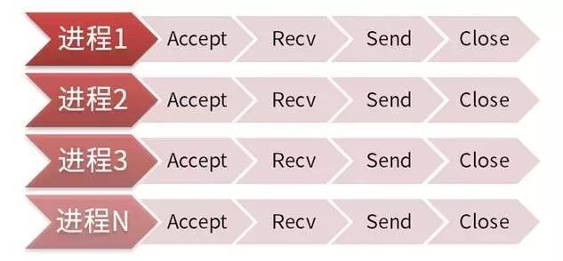
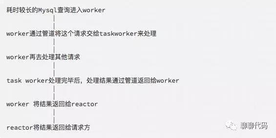

# 理解Nginx和Swoole的高并发原理

## 阅前热身

​    为了更加形象的说明`同步/异步`、`阻塞/非阻塞`，我们以小明去买奶茶为例。

## 同步与异步

+ 同步：当一个`同步调用`发出去后，`调用者`要一直`等待调用结果的通知`，直到`得到调用结果`。
+ 异步：当一个`异步调用`发出去后，`调用者`不能`立即得到调用结果的返回`。

对于`异步调用`，要想获得结果，一般有`2种`方式：

+ 主动`轮询`异步调用的结果
+ 被调用方通过`callback`来通知调用方调用结果

举个栗子

+ 同步买奶茶：小明点单交钱，然后等着拿奶茶。
+ 异步买奶茶：小明点单交钱，店员给小明一个小票，等小明奶茶做好了再来取。

异步买奶茶，小明要想知道奶茶是否做好了，有`2种`方式：

- 小明主动去问店员，一会就去问一下：“奶茶做好了吗？”...直到奶茶做好。
- 等奶茶做好了，店员喊一声：“小明，奶茶好了！”，然后小明去取奶茶。

总结：`同步与异步`的重点在`消息通知的方式`上，也就是`调用结果通知的方式`。

## 阻塞与非阻塞

+ `阻塞调用`发出去后，在`消息返回`之前，当前`进/线程`会被`挂起`，直到有`消息返回`，当前`进/线程`才会被`激活`。
+ `非阻塞调用`发出去后，不会`阻塞`当前`进/线程`，而会`立即返回`。

举个栗子

+ 阻塞买奶茶：小明点单交钱，干等着拿奶茶，什么事都不做。
+ 非阻塞买奶茶：小明点单交钱，等着拿奶茶，等的过程中，时不时刷刷微博、朋友圈

总结：`同步与异步`重点在于`消息通知的方式`，`阻塞与非阻塞`重点在于`等消息时候的行为`。

所以，就有了下面4种组合方式：

+ 同步阻塞：小明在柜台干等着拿奶茶；
+ 同步非阻塞：小明在柜台边刷微博边等着拿奶茶；
+ 异步阻塞：小明拿着小票啥都不干，一直等着店员通知他拿奶茶；
+ 异步非阻塞：小明拿着小票，刷着微博，等着店员通知他拿奶茶。

总结：`阻塞与非阻塞`的重点在于`进/线程等待消息时候的行为`，也就是在等待消息的时候，当前进/线程是`挂起`状态，还是`非挂起`状态。

## Nginx如何处理高并发

​     Apache处理一个请求是同步阻塞的模式。如图：

每到达一个请求，Apache都会去fork一个子进程去处理这个请求，直到这个请求处理完毕。面对低并发，这种模式没什么缺点，但是，面对高并发，就是这种模式的软肋了。

​    1个客户端占用1个进程，那么，进程数量有多少，并发处理能力就有多少，但操作系统可以创建的进程数量是有限的。并且，多进程就会有进程间的切换问题，而进程间的切换调度势必会造成CPU的额外消耗。当进程数量达到成千上万的时候，进程间的切换就占了CPU大部分的时间片，而真正进程的执行反而占了CPU的一小部分，这就得不偿失了。

下面，举例说明这2种场景是多进程模式的软肋：

+ 即时消息通知程序比如及时聊天程序，一台服务器可能要维持数十万的连接，那么就要启动数十万的进程来维持。这显然不可能。

+ 调用外部Http接口时假设Apache启动100个进程来处理请求，每个请求消耗100ms，那么这100个进程能提供1000qps。但是，在我们调用外部Http接口时，比如QQ登录、微博登录，耗时较长，假设一个请求消耗10s，也就是1个进程1s处理0.1个请求，那么100个进程只能达到10qps，这样的处理能力就未免太差了。

传统的`服务器模型`就是这样，因为其`同步阻塞`的`多进程模型`，无法面对`高并发`。那么，有没有一种方式可以让我们`在一个进程处理所有的并发I/O`呢？答案是有的，这就是`I/O复用技术`。

## I/O复用

​    所谓的`I/O复用`，就是`多个I/O可以复用一个进程`。上面说的`同步阻塞`的`多进程模型`不适合处理高并发，那么，我们再来考虑`非阻塞`的方式。采用`非阻塞`的模式，当一个连接过来时，我们不阻塞住，这样一个进程可以同时处理多个连接了。

​    比如一个进程接受了`10000`个连接，这个进程每次`从头到尾`的问一遍这`10000`个连接：`“有I/O事件没？有的话就交给我处理，没有的话我一会再来问一遍。”`然后进程就一直从头到尾问这`10000`个连接，如果这`1000`个连接都没有`I/O事件`，就会造成`CPU的空转`，并且`效率也很低`，不好不好。

​    于是伟大的程序猿们日思夜想的去解决这个问题...终于！

+ 我们能不能引入一个`代理`，这个`代理`可以`同时观察许多I/O流事件`呢？

当没有`I/O事件`的时候，这个进程处于`阻塞状态`；当有`I/O事件`的时候，这个`代理`就去`通知进程醒来`？

于是，早期的程序猿们发明了两个代理：`select`、`poll`。

-  `select`、`poll`代理的原理是这样的：

当连接有`I/O流事件`产生的时候，就会去`唤醒进程去处理`。但是进程并不知道是`哪个连接产生的I/O流事件`，于是进程就挨个去问：“请问是你有事要处理吗？”......问了`99999`遍，哦，原来是第`100000`个进程有事要处理。那么，前面这`99999`次就白问了，白白浪费宝贵的`CPU时间片`了！痛哉，惜哉...

注：`select`与`poll`原理是一样的，只不过`select`只能观察`1024`个连接，`poll`可以观察`无限个`连接。

上面看了，`select`、`poll`因为不知道哪个连接有`I/O流事件`要处理，性能也挺不好的。

那么，如果发明一个代理，每次能够知道哪个连接有了`I/O流事件`，不就可以避免无意义的空转了吗？

于是，超级无敌、闪闪发光的`epoll`被伟大的程序员发明出来了。

-  `epoll`代理的原理是这样的：

当连接有`I/O流事件`产生的时候，`epoll`就会去告诉进程哪个连接有`I/O流事件`产生，然后进程就去处理这个连接

## Swoole如何处理高并发以及异步I/O的实现

### Reactor模型

​    `IO复用异步非阻塞`程序使用经典的`Reactor模型`，`Reactor`顾名思义就是`反应堆`的意思，它本身`不处理任何数据收发`。只是可以监视一个socket（也可以是管道、eventfd、信号）句柄的事件变化。

### 句柄

​    `句柄`英文为`handler`，可以形象的比喻为`锅柄、勺柄`。也就是`资源的唯一标识符`、`资源的ID`。通过这个ID可以操作资源。

​    `Reactor`只是一个`事件发生器`，实际对`socket句柄`的操作，如`connect/accept、send/recv、close是在callback中完成的`。

## Swoole如何实现异步I/O

`Swoole`的`worker`进程有2种类型：一种是普通的`worker进程`，一种是`task worker进程`。

- `worker进程`：用来处理普通的耗时不是太长的请求
- `task worker进程`：用来处理耗时较长的请求，比如数据库的`I/O`操作

我们以`异步MySQL`举例：

如此，通过`worker、task worker`结合的方式，我们就实现了`异步I/O`。