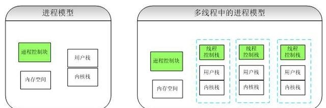

# PHP的进程和线程理解

## 什么是进程

​    进程是程序执行是的一个实例，进程能够分配给cpu和内存等资源。进程一般包括指令集和系统资源，其中指令集就是你的代码，系统资源就是指cpu、内存以及I/O等。

## 什么是线程

​    线程是进程的一个执行流，线程不能分配系统资源，它是进程的一部分，比进程更小的独立运行的单位。解释一下：进程有两个特性：一是资源的所有权，一个是调度执行（指令集），线程是调度执行中的一部分，是指进程执行过程的路径，也叫程序执行流。线程有时候也叫轻量级进程。

## 进程和线程的关系

​    进程就像地主，有土地（系统资源），线程就像佃户（线程，执行种地流程）。每个地主（进程）只要有一个干活的佃户（线程）。

​    进程-资源分配的最小单位，相对健壮，崩溃一般不影响其他进程，但是切换进程时耗费资源，效率差些。

​    线程-程序执行的最小单位，没有独立的地址空间，一个线程死掉可能整个进程就死掉，但是节省资源，切换效率高。

## CPU、进程与线程

计算机的核心是CPU，它承担了所有的计算任务。它就像一座工厂，时刻在运行。假定工厂的电力有限，一次只能供给一个车间使用。也就是说，一个车间开工的时候，其他的车间必须停工。背后的含义就是，单个CPU一次只能运行一个任务

+ 进程就好比工厂车间，它代表CPU所能处理的单个任务。任一时刻，CPU总是运行一个进程，其它进程处于非运行状态

- 一个车间里，可以有很多工人。他们协同完成一个任务！（线程就好比车间里的工人。一个进程可以包括多个线程）
- 车间里的空间是工人们共享的，比如许多房间是每个工人都可以进出的。这象征一个进程的内存空间是共享的，每个线程都可以使用这些共享内存
- 可是每个房间的大小不同，有些房间最多只能容纳一个人，比如厕所。里面有人的时候，其他人就不能进去了。这代表一个线程使用某些共享内存时，其他线程必须等他结束，才能使用这一块内存
- 一个防止他人进入的简单方法，就是门口加一把锁。先到的人锁上门，后到的人看到上锁，就在门口排队，等锁打开在进去。这就叫“互斥锁”,防止多个线程同时读写某一块内存区域
- 还有些房间，可以同时容纳n个人，比如厨房。也就是说，如果人数大于n，多出来的人只能在外面等着。这好比某些内存区域，只能供给固定数目的线程使用。解决方法，就在门口挂n把锁。进去的人就取一把钥匙，出来时再把钥匙挂回原处。后到的人发现钥匙架空了，就知道必须在门口排队等着了。这种做法就叫“信号量”（Semaphore），用来保证多个线程不会互相冲突

## 孤儿进程

​    一个父进程退出，而它的一个或多个子进程还在运行，那么那些子进程将成为孤儿进程。孤儿进程将被init进程(进程号为1)所收养，并由init进程对它们完成状态收集工作。

## 僵尸进程

​    一个进程使用fork创建子进程，如果子进程退出，而父进程并没有调用wait或waitpid获取子进程的状态信息，那么子进程的进程描述符仍然保存在系统中。这种进程称之为僵死进程。

​    fork是UNIX关于进程管理的一个术语，本质是新开一个进程，但是不从磁盘加载代码，而是从内存现有进程复制一份。

## 守护进程

​    守护进程(daemon)是一类在后台运行的特殊进程，用于执行特定的系统任务。很多守护进程在系统引导的时候启动，并且一直运行直到系统关闭。另一些只在需要的时候才启动，完成任务后就自动结束。

## 多进程与多线程比较

|  **对比维度**  |                          **多进程**                          |                          **多线程**                          | **总结** |
| :------------: | :----------------------------------------------------------: | :----------------------------------------------------------: | :------: |
| 数据共享、同步 |       数据共享复杂，需要用IPC；数据是分开的，同步简单        | 因为共享进程数据，数据共享简单，但也是因为这个原因导致同步复杂 | 各有优势 |
|   内存、CPU    |              占用内存多，切换复杂，CPU利用率低               |              占用内存少，切换简单，CPU利用率高               | 线程占优 |
| 创建销毁、切换 |                  创建销毁、切换复杂，速度慢                  |                 创建销毁、切换简单，速度很快                 | 线程占优 |
|   编程、调试   |                      编程简单，调试简单                      |                      编程复杂，调试复杂                      | 进程占优 |
|     可靠性     |                      进程间不会互相影响                      |                一个线程挂掉将导致整个进程挂掉                | 进程占优 |
|     分布式     | 适应于多核、多机分布式；如果一台机器不够，扩展到多台机器比较简单 |                       适应于多核分布式                       | 进程占优 |

## php编程常见的进程和线程

+ 在web应用中，我们每次访问php，就建立一个PHP进程，当然也会建立至少一个PHP线程。
+ PHP使用pcntl来进行多进程编程
+ PHP中使用pthreads来进行多线程编程
+ nginx的每个进程只有一个线程，每个线程可以处理多个客户端的访问
+ php-fpm使用多进程模型，每个进程只有一个线程，每个线程只能处理一个客户端访问
+ apache可能使用多进程模型，也可能使用多线程模型，取决于使用哪种SAPI